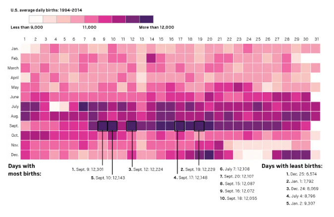

```{r, include = FALSE}
require(mosaic)
require(mosaicData)
require(Lock5Data)
data(SalaryGender)
data("BaseballSalaries2019")
require(gridExtra)
theme_set(theme_minimal())
require(forcats)
require(MASS)
require(viridis)
require(scales)
require(tidyr)
require(ggrepel)
require(maps)
data(world.cities)
data("MarriageAges")
library(ggpubr)
require(ggrepel)
require(ggmosaic)
require(palmerpenguins)
require(ggformula)
require(ggridges)
require(readr)
require(socviz)
require(stringr)
require(paletteer) # palettes
require(RColorBrewer) # palettes

data(fly)
fly = na.omit(fly)

data("penguins")
penguins = na.omit(penguins)

data("gss_sm")
gss_sm = na.omit(gss_sm)
require(gapminder)
require(ggplot2)
data("Birthdays")
require(colorspace)
```

Within a graph, you may want to alter the color of specific items. To do this, we first need to talk about how to change the color of some items (as it depends on what you want to alter). For example:

-   [Use **color** for things like:]{.underline} points, lines, text, and outlines or boxplots

-   [Use **fill** for things like:]{.underline} bars, densities (or areas), polygons, ribbons, and inside boxplots

The general way to change color using color or fill option is:

-   **Color:** gf_plot(Y \~ X, data = Dataset, **color** = "ColorName")

-   **Fill:** gf_plot(Y \~ X, data = Dataset, **fill** = "ColorName")

# Color Points & Lines

Alter the color of points, lines, and text using color = "ColorName". You can specify the color of points and/or lines with the color name, hex code, or rgb code.

**Example:** gf_plot(Y \~ X, data = Dataset, color = "ColorName")

```{r, include = FALSE}
peng2 = penguins %>%
  group_by(species) %>%
  mutate(mean.length = mean(bill_length_mm),
         mean.depth = mean(bill_depth_mm))
```

```{r}
point = gf_point(bill_length_mm~bill_depth_mm, data = penguins, color = "#b715e5") %>%
  gf_labs(title = "Points")

line2 = gf_dens(~bill_length_mm, data = penguins, color = "#b715e5") %>%
  gf_labs(title = "Lines")

text2 = gf_text(mean.length~mean.depth, data= peng2, label = ~species, color = "#b715e5", hjust = "inward") %>%
  gf_labs(title = "Text")

grid.arrange(point, line2, text2, nrow = 1)
```

# Fill Bars & Densities

Bars and densities have color altered using the fill = "ColorName" command. The plot below shows the difference between trying to alter the color vs. fill of various plots. To alter the fill color, specify the color name, hex code, or rgb code.

**Example:** gf_plot(Y \~ X, data = Dataset, fill = "ColorName")

```{r}
bar.color = gf_bar(~species, data = penguins, color = "#b715e5") %>%
  gf_labs(title = "color") %>%
  gf_refine(scale_x_discrete(guide = guide_axis(n.dodge = 2))) 
bar.fill = gf_bar(~species, data = penguins, fill = "#b715e5") %>%
  gf_labs(title = "fill") %>%
  gf_refine(scale_x_discrete(guide = guide_axis(n.dodge = 2))) 

hist.color = gf_histogram(~bill_length_mm, data = penguins, color = "#b715e5") %>%
  gf_labs(title = "color")
hist.fill = gf_histogram(~bill_length_mm, data = penguins, fill = "#b715e5") %>%
  gf_labs(title = "fill")

box.color = gf_boxplot(bill_length_mm~species, data = penguins, color = "#b715e5") %>%
  gf_labs(title = "color") %>%
  gf_refine(scale_x_discrete(guide = guide_axis(n.dodge = 2))) 
box.fill = gf_boxplot(bill_length_mm~species, data = penguins, fill = "#b715e5") %>%
  gf_labs(title = "fill") %>%
  gf_refine(scale_x_discrete(guide = guide_axis(n.dodge = 2))) 

dens.color = gf_density(~bill_length_mm, data = penguins, color = "#b715e5") %>%
  gf_labs(title = "color")
dens.fill = gf_density(~bill_length_mm, data = penguins, fill = "#b715e5") %>%
  gf_labs(title = "fill")

grid.arrange(bar.color, bar.fill, hist.color, hist.fill, box.color, box.fill, dens.color, dens.fill, nrow = 2)
```

# General Ways to Adjust Color

There are 4 main ways we'll adjust color:

**Color (or Fill) by Specified Color (name, hex or code):** color = "Color Name"

**Color (or Fill) and Specify Label:** color = \~"Label Name"

**Color (or Fill) by Variable:** color = \~ Variable

**Color (or Fill) by Condition:** color = \~ (Var \< 10) or color = \~ (Var == "Category")

# Specify Color

In the example below, we layer many lines & text onto a plot. It is helpful to adjust the color of such elements. For each, we can adjust using the color = "ColorName" option. Again, any color can be specified using a name, hex code, or rgb code.

**Color Name:** color = "orange"

**Hex Code:** color = "#cda209"

**RGB (Proportions):** color = rgb(0.09, 0.2, 0.16)

**RGB (Values):** color = rgb(9, 205, 162, maxColorValue = 255)

```{r}
gf_dist("chisq", df=5) %>%
gf_dist("chisq", df=10, color ="orange") %>%
gf_dist("chisq", df=20, color ="darkcyan", linetype = "dashed") %>%
  gf_theme(theme_classic()) %>%
  gf_text(x = 7, y = 0.12, label = "df = 5", hjust = "left") %>%
  gf_text(x = 15, y = 0.08, label = "df = 10", color = "orange", hjust = "left") %>%
  gf_text(x = 26, y = 0.05, label = "df = 20", color = "darkcyan", hjust = "left") %>%
  gf_labs(title = "Specify Color")
```

```{r}
gf_dist("chisq", df=5, color = "purple") %>%
gf_dist("chisq", df=10, color ="#cda209") %>%
gf_dist("chisq", df=20, color = rgb(9, 205, 162, maxColorValue = 255), linetype = "dashed") %>%
  gf_theme(theme_classic()) %>%
  gf_text(x = 7, y = 0.12, label = "purple", hjust = "left", color = "purple") %>%
  gf_text(x = 15, y = 0.08, label = "#cda209", color = "#cda209", hjust = "left") %>%
  gf_text(x = 26, y = 0.05, label = "rgb(9, 205, 162, maxColorValue = 255)", color = rgb(9, 205, 162, maxColorValue = 255), hjust = "left") %>%
  gf_labs(title = "Specify Color")
```

## Specify Label

You can also specify the color label using color = \~"Label" option. Without specifying color more, R will use default colors, but will have the labels you want. You can certainly then use the discrete methods (below) to adjust specific colors further.

**Example (color):** gf_plot(Y\~X, data = DatasetName, color = \~"Label Here")

**Example (fill):** gf_plot(Y\~X, data = DatasetName, fill = \~"Label Here")

```{r}
gf_dist("chisq", df=5, color = ~"df = 5") %>%
gf_dist("chisq", df=10, color =~ "df = 10") %>%
gf_dist("chisq", df=20, color = ~"df = 20", linetype = "dashed") 
```

# Discrete Color

To color or fill by a discrete variable, use color = \~Var or fill = \~Var. R will default to assign a different color to each category. Most of the time, you'll want to think about how you want to color (e.g. are items sequential, are there colors associated with each category, do we really need to color each category or just highlight some, etc.). The sections below will provide several options for adjusting default colors.

**Color by Discrete Variable:** gf_plot(Y \~ X, data = Dataset, color = \~Var)

**Fill by Discrete Variable:** gf_plot(Y \~ X, data = Dataset, fill = \~Var)

```{r}
gf_point(flipper_length_mm~bill_length_mm, data = penguins, color = ~species)%>%
  gf_labs(title = "Color by Species")

gf_histogram(~flipper_length_mm, data = penguins, fill=~species, alpha = 0.5, position = position_identity()) %>%
  gf_labs(title = "Fill by Species")
```

## Conditional Discrete Coloring

Perhaps you want to highlight certain categories. The following examples show ways of conditional coloring. The default labels are not ideal, so I'd recommend adjusting the labels to be more clear (or better yet - label directly!).

**Condition Color:** gf_plot(Y \~ X, data = Dataset, color = \~(Var == "Category"))

**Adjust Labels for Color Legend:** gf_refine(scale_color_discrete(labels = c("Label 1", "Label 2")))

**Condition Fill:** gf_plot(Y \~ X, data = Dataset, fill = \~(Var != "Category"))

**Adjust Labels for Fill Legend:** gf_refine(scale_fill_discrete(labels = c("Label 1", "Label 2")))

Recall you can alter the legend title using gf_labs( ) or within the scale\_\*\_discrete( name = "Title" ) command.

**Adjust Color/Fill Title:** scale\_\*\_discrete( name = "Title" )

```{r}
gf_point(flipper_length_mm~bill_length_mm, data = penguins, color = ~(species == "Adelie"))%>%
  gf_labs(title = "Color by Species", color = "Species") %>%
  gf_refine(scale_color_discrete(labels = c("Other Species", "Adelie")))

gf_histogram(~flipper_length_mm, data = penguins, fill=~(species != "Gentoo"), alpha = 0.5, position = position_identity()) %>%
  gf_labs(title = "Fill by Species") %>%
  gf_refine(scale_fill_discrete(labels = c("Gentoo", "Not Gentoo"), name = "Species"))
```

## Adjusting Default Colors

For adjusting any color or fill, you want to use the corresponding scale adjustment:

**Adjust Color:** scale_color_XXX( ) (see table below for subbing in XXX options)

**Adjust Fill**: scale_fill_XXX( )

If you want to reverse any palette, you can do so specifying within the same command using limits = rev.

**Reverse any palette:** scale_fill_XXX( ... , limits = rev )

Below is a table summarizing several ways to adjust color of discrete variables. More details can be found in [Chapter 4](https://clauswilke.com/dataviz/color-basics.html) and [Chapter 19](https://clauswilke.com/dataviz/color-pitfalls.html) of Wilke's Fundamentals of Data Visualization.

+---------------+---------------------------------------------------------+
| Color Type    | Code Format                                             |
+===============+=========================================================+
| Manual        | scale_fill_manual( values = c( "Color 1" , "Color 2" )) |
+---------------+---------------------------------------------------------+
| Hue           | scale_color_hue(h = c(60, 180))                         |
+---------------+---------------------------------------------------------+
| Grey          | scale_color_grey()                                      |
+---------------+---------------------------------------------------------+
| Brewer        | scale_fill_brewer( palette = "Greens" )                 |
+---------------+---------------------------------------------------------+
| Viridis       | scale_fill_viridis(discrete = TRUE, option = "magma")   |
+---------------+---------------------------------------------------------+
| Paletteer     | scale_color_paletteer_d("palettetown::charmeleon")      |
+---------------+---------------------------------------------------------+
| Colorspace    | scale_color_discrete_qualitative(palette = "Dark 3")    |
|               |                                                         |
|               | scale_fill_discrete_sequential(palette = "Purples")     |
+---------------+---------------------------------------------------------+

## Manual Color

You can certainly pick colors you just like the look of, but it may be helpful to think of how you want to use those colors. For example, do you want to highlight a certain group or alert the reader to a specific portion of the graph? Are there colors that are socially associated with certain categories (e.g. profit/loss or political party)? Does your company want to use brand-specific colors? Point being, you want to think about what colors you're using and have a purpose for them.

**Manual Color:** gf_refine(scale_color_manual(values = c("Color1","Color2","Color3")))

**Manual Fill:** gf_refine(scale_fill_manual(values = c("Color1","Color2","Color3")))

**Reverse Color/Fill:** scale\_\*\_manual(values = c("Color1","Color2","Color3"), limits = rev)

See Picking Colors & Palettes page for details on specific color choices.

```{r}
gf_point(flipper_length_mm~bill_length_mm, data = penguins, color = ~species)%>%
  gf_refine(scale_color_manual(values = c("darkorange","purple","cyan4"))) %>%
  gf_labs(title = "Color by Species")

gf_histogram(~flipper_length_mm, data = penguins, fill=~species, alpha = 0.5, position = position_identity()) %>%
  gf_refine(scale_fill_manual(values = c("darkorange","purple","cyan4"), limits = rev)) %>%   gf_labs(title = "Fill by Species")
```

If you want to assign specific colors to specific categories, you can specify both the category and the color (as seen in the example below).

```{r}
gf_bar(~Type, data  = Cars93, fill = ~Type) %>%
  gf_refine(scale_fill_manual(values = c("Small" = "gray85",
                                         "Compact" = "gray85",
                                         "Midsize" = "gray85",
                                         "Sporty" = "gray85",
                                         "Large" = "black",
                                         "Van" = "black"))) %>%
  gf_labs(title = "Assign colors to specific categories")
```

## Spaced Color Hue

Coloring by a discrete variable has a couple options that are not available (currently) for continuous variables. Color by hue and using grey scale (next section) are two of those options only available for discrete variables.

To use scale_color_hue, you pick 2 hue values (from a range of 0 to 360) and R will choose n options evenly spaced between those hues (where n is the number of categories to be colored). Here is a link to more information on [scale_color_hue](https://ggplot2.tidyverse.org/reference/scale_hue.html).

```{r, echo = FALSE}
x = seq(from = 1, to = 360, by = 10)
x2 = seq(from = 30, to = 330, by = 30)
gf_tile(0.5~x, fill = ~as.factor(x), show.legend = FALSE) %>%
  gf_refine(scale_fill_hue(h = c(0,360)),
            scale_x_continuous(breaks = breaks_width(30))) %>%
  gf_labs(title = "Hue Values", y = "", x = "") %>%
  gf_theme(axis.text.y = element_blank(), 
           axis.ticks.y = element_blank())
```

**Color hue:** gf_refine(scale_color_hue(h = c(60, 180)))

**Fill hue (reverse):** gf_refine(scale_fill_hue(h = c(180, 300), limits = rev))

```{r}
gf_point(flipper_length_mm~bill_length_mm, data = penguins, color = ~species)%>%
  gf_refine(scale_color_hue(h = c(60, 180))) %>%
  gf_labs(title = "Color by Species")

gf_histogram(~flipper_length_mm, data = penguins, fill=~species, alpha = 0.5, position = position_identity()) %>%
  gf_refine(scale_fill_hue(h = c(180, 300), limits = rev)) %>% 
  gf_labs(title = "Fill by Species")
```

## Grey scale

Sometimes you don't really need a color, but rather may want to just distinguish categories using grey scale. Several authors I've enjoyed sing praise for the use of grey for reemphasizing things we don't need to focus on, but also easing the strain of our mental capacities in trying to figure out what the colors mean/just deciphering colors.

**Color/fill grey scale:** gf_refine(scale\_\*\_grey())

**Color/Fill grey reverse:** gf_refine(scale\_\*\_grey(limits = rev))

More information on grey scale can be found [here](https://ggplot2.tidyverse.org/reference/scale_grey.html).

```{r}
gf_point(flipper_length_mm~bill_length_mm, data = penguins, color = ~species)%>%
  gf_refine(scale_color_grey()) %>%
  gf_labs(title = "Color by Species")

gf_histogram(~flipper_length_mm, data = penguins, fill=~species, alpha = 0.5, position = position_identity()) %>%
  gf_refine(scale_fill_grey(limits = rev)) %>% 
  gf_labs(title = "Fill by Species")
```

## Brewer Palette

Brewer seems to be a commonly used pallet selector. There are many palette options including categorical options, sequential options, diverging options, and even paired options. There are also many colorblind friendly palettes available. See the Picking Colors & Palettes page for more details on specific palettes. You may need to install the RColorBrewer package to take advantage of these palettes.

**Color/Fill by Brewer Palette:** gf_refine(scale_color_brewer(palette = "Dark2"))

**Color/Fill Brewer reverse:** gf_refine(scale_fill_brewer(palette = "Dark2", limits = rev))

```{r}
gf_point(flipper_length_mm~bill_length_mm, data = penguins, color = ~species)%>%
  gf_refine(scale_color_brewer(palette = "Dark2")) %>%
  gf_labs(title = "Color by Species")

gf_histogram(~flipper_length_mm, data = penguins, fill=~species, alpha = 0.5, position = position_identity()) %>%
  gf_refine(scale_fill_brewer(palette = "Dark2", limits = rev)) %>% 
  gf_labs(title = "Fill by Species")
```

## Viridis Palette

The Viridis palette package is another package I've seen widely used. I was first introduced to these palettes as colorblind friendly alternatives to the rainbow palette. I also find them aesthetically pleasing palettes to use.

The default viridis color/fill is for continuous variables, however, you can still use these palettes for discrete variables. We just need to specify discrete = TRUE. Additionally, the way you alter the palette choice is using option = "magma" rather than the brewer specifications using palette = "Blues". It is a bit cumbersome to keep all these nuances straight - so I find the summary table (above) helpful for quickly determining the options needed based on the type of palette package I want to use.

**Default Discrete Viridis Palette:** gf_refine(scale_color_viridis(discrete = TRUE))

**Specify Option & Reverse Viridis:** gf_refine(scale_fill_viridis(discrete = TRUE, option = "magma", limits = rev))

**Adjust begin & end points Viridis:** gf_refine(scale_color_viridis(discrete = TRUE, begin = 0.2, end = 0.7))

```{r}
gf_point(flipper_length_mm~bill_length_mm, data = penguins, color = ~species)%>%
  gf_refine(scale_color_viridis(discrete = TRUE)) %>%
  gf_labs(title = "Color by Species")

gf_point(flipper_length_mm~bill_length_mm, data = penguins, color = ~species)%>%
  gf_refine(scale_color_viridis(discrete = TRUE, begin = 0.2, end = 0.7)) %>%
  gf_labs(title = "Color by Species")

gf_histogram(~flipper_length_mm, data = penguins, fill=~species, alpha = 0.5, position = position_identity()) %>%
  gf_refine(scale_fill_viridis(discrete = TRUE, option = "magma", limits = rev)) %>% 
  gf_labs(title = "Fill by Species")
```

## Paletteer (Other Palettes)

My understanding of the Paletteer package is to provide a way to access any and all palettes in one command. Because there are SO many, take advantage of auto-fill! Note, once you start typing within scale_color_paletteer_d() you should have a scroll-menu to choose from all the types of palettes from all types of packages.

**Discrete Paletteer Color:** gf_refine(scale_color_paletteer_d("palettetown::charmeleon"))

**Discrete Paletteer Fill (reverse):** gf_refine(scale_fill_paletteer_d("awtools::ppalette", limits = rev))

```{r}
gf_point(flipper_length_mm~bill_length_mm, data = penguins, color = ~species)%>%
  gf_refine(scale_color_paletteer_d("palettetown::charmeleon")) %>%
  gf_labs(title = "Color by Species")

gf_histogram(~flipper_length_mm, data = penguins, fill=~species, alpha = 0.5, position = position_identity()) %>%
  gf_refine(scale_fill_paletteer_d("awtools::ppalette", limits = rev)) %>% 
  gf_labs(title = "Fill by Species")
```

## Colorspace

Below are just a couple ways to use the colorspace package to adjust color. The [reference page](https://colorspace.r-forge.r-project.org/reference/index.html) has many other details.

**Color discrete qualitative:** gf_refine(scale_color_discrete_qualitative(palette = "Dark 3"))

**Fill discrete sequential (reverse):** gf_refine(scale_fill_discrete_sequential(palette = "Purples", limits = rev))

```{r}
gf_point(flipper_length_mm~bill_length_mm, data = penguins, color = ~species)%>%
  gf_refine(scale_color_discrete_qualitative(palette = "Dark 3")) %>%
  gf_labs(title = "Color by Species")

gf_density(~flipper_length_mm, data = penguins, fill=~species, alpha = 0.5, position = position_identity(), color = "black") %>%
  gf_refine(scale_fill_discrete_sequential(palette = "Purples", limits = rev)) %>% 
  gf_labs(title = "Fill by Species")
```

## Specify both Color & Variable

The following example illustrates the different use of color in different layers of your visual. The background layer fills by a single color (gray85) while the top layer fills by a variable.

```{r, include = FALSE}
HighLow = Weather %>%
  group_by(date) %>%
  mutate(lowest = min(low_temp),
         highest = max(high_temp))
```

```{r}
gf_ribbon(lowest+highest~date, data = HighLow, fill="gray85") %>%
gf_ribbon(low_temp+high_temp~date, data=Weather, fill=~city) %>%
  gf_theme(theme_classic()) %>%
  gf_theme(legend.position = "none") %>%
  gf_facet_wrap(~city) %>%
  gf_refine(scale_x_date(date_breaks = "8 months", date_labels = "%b %y")) %>%
  gf_labs(x = "", y = "Temperature", title = "Fill by City (Variable)", subtitle = "Fill = gray85 for background reference") 
```

## Gapminder colors

The Gapminder package has built in country & continent colors. The examples below utilize each of the different types of color.

**Continent Color:** gf_refine(scale_color_manual(values = continent_colors))

**Country Color:** gf_refine(scale_color_manual(values = country_colors))

```{r}
gf_summary(lifeExp~year, data = gapminder, fun="mean", color = ~continent, geom = "line") %>%
  gf_lims(x = c(1950, 2015))%>%
  gf_text(lifeExp~year, data = subset(gapminder, year == 2007), hjust = "outward", label = ~continent, stat = "summary", position = position_nudge(x = 1), fun = "mean")  %>%
  gf_theme(legend.position = "none")  %>%
  gf_labs(title = "Default Colors")

gf_summary(lifeExp~year, data = gapminder, fun="mean", color = ~continent, geom = "line") %>%
  gf_lims(x = c(1950, 2015))%>%
  gf_text(lifeExp~year, data = subset(gapminder, year == 2007), hjust = "outward", label = ~continent, stat = "summary", position = position_nudge(x = 1), fun = "mean")  %>%
  gf_theme(legend.position = "none") %>%
  gf_refine(scale_color_manual(values = continent_colors))  %>%
  gf_labs(title = "Continent Colors")

gf_point(lifeExp~log(gdpPercap), data = subset(gapminder, year == 1997), color = ~country, size = ~pop, alpha = 0.3, show.legend = FALSE) %>%
  gf_facet_wrap(~continent) %>%
  gf_refine(scale_size_continuous(range = c(1,12)))  %>%
  gf_labs(title = "Default Colors")

gf_point(lifeExp~log(gdpPercap), data = subset(gapminder, year == 1997), color = ~country, size = ~pop, alpha = 0.3, show.legend = FALSE) %>%
  gf_facet_wrap(~continent) %>%
  gf_refine(scale_color_manual(values = country_colors),
            scale_size_continuous(range = c(1,12)))  %>%
  gf_labs(title = "Country Colors")
```

# Continuous Color

```{r, include = FALSE}
df.volcano = as.data.frame(volcano) %>%
  mutate(X = seq(from = 1, to = 87, by=1)) %>%
  pivot_longer(cols = starts_with("V"), names_to = "Y", names_prefix = "V", values_to = "Z") %>%
  mutate(Y = as.numeric(Y))

temps_months <- read_csv("https://wilkelab.org/SDS375/datasets/tempnormals.csv") %>%
  group_by(location, month_name) %>%
  summarize(mean = mean(temperature)) %>%
  mutate(
    month = factor(
      month_name,
      levels = c("Jan", "Feb", "Mar", "Apr", "May", "Jun",
                 "Jul", "Aug", "Sep", "Oct", "Nov", "Dec")
    ),
    location = factor(
      location, levels = c("Death Valley", "Houston", "San Diego", "Chicago")
    )
  ) %>%
  dplyr::select(-month_name)
```

To assign color to a continuous variable, we do so in the same way we did for a discrete: color = \~Var or fill = \~Var.

**Color by Variable:** gf_plot(Y\~X, data = Dataset, color = \~Var)

**Fill by Variable:** gf_plot(Y\~X, data = Dataset, fill = \~Var)

The examples below show both color and fill, and also a raster plot which "fills" by a variable built into the function (so you don't specify fill, but rather the first variable in the command will be the "fill" variable).

**Raster (note slightly atypical ordering of variables):** gf_raster(FillVar \~ X + Y , data = Dataset)

```{r}
gf_tile(location~month, data = temps_months, fill=~mean) %>%
  gf_refine(coord_fixed()) %>%
  gf_labs(title = "Fill by Continuous Variable")

gf_raster(Z~X+Y, data = df.volcano) %>%
  gf_theme(theme_void) %>%
  gf_labs(title = "Raster Builds in Fill Option (Z~)")

gf_point(bill_length_mm~bill_depth_mm, data = penguins, color = ~body_mass_g, size = ~body_mass_g, alpha = 0.4) %>%
  gf_refine(scale_color_continuous(guide = "legend")) %>%
  gf_labs(title = "Color by Continuous Variable")
```

## Conditional Color

If you want to conditionally color or fill a continuous variable, R will essentially make a discrete variable: yes/no out of your continuous variable.

```{r}
gf_tile(location~month, data = temps_months, fill=~mean>80) %>%
  gf_refine(coord_fixed()) %>%
  gf_labs(title = "Fill if mean > 80")
```

If on the other hand you just want to color a certain range of values, you can specify the limits of those values within a scale_fill/color_continuous( ) command.

**Adjust limits color/filled:** gf_refine(scale_fill_continuous(limits = c(a,b)))

**Omit missing data:** scale_fill_continuous(limits = c(a,b), na.value = NA)

**Color missing data:** scale_fill_continuous(limits = c(a,b), na.value = "Color Name")

```{r}
gf_tile(location~month, data = temps_months, fill=~mean) %>%
  gf_refine(coord_fixed(),
            scale_fill_continuous(limits = c(60,100))) %>%
  gf_labs(title = "Fill only from 60 to 100", subtitle = "Data outside this range: gray default")

gf_raster(Z~X+Y, data = df.volcano) %>%
  gf_theme(theme_void) %>%
  gf_labs(title = "Fill only 110 to 200", subtitle = "Omit all missing data") %>%
  gf_refine(scale_fill_continuous(limits = c(110, 200), na.value = NA))

gf_point(bill_length_mm~bill_depth_mm, data = penguins, color = ~body_mass_g, size = ~body_mass_g, alpha = 0.4) %>%
  gf_refine(scale_color_continuous(guide = "legend",
                                   limits = c(4000,6000),
                                   na.value = "yellow")) %>%
  gf_labs(title = "Only color from 4K to 6K", subtitle = "All missing data yellow")

gf_point(bill_length_mm~bill_depth_mm, data = penguins, color = ~body_mass_g, size = ~body_mass_g, alpha = 0.4) %>%
  gf_refine(scale_size_continuous(limits = c(4000,6000)),
            scale_color_continuous(guide = "legend",
                                   limits = c(4000,6000),
                                   na.value = "yellow")) %>%
  gf_labs(title = "Adjust scale and color to combine legends", subtitle = "Missing data no longer plotted, even if you try to specify")
```

## Manual Colors (Gradient)

To adjust colors used in your visual for continuous data, you can specify exactly which colors you want using the scale_fill_gradient() command. There are a few variations of this command, so I've summarized them below. That said, they all go in a gf_refine( ) statement as follows:

**Example:** gf_refine(scale_fill_gradient(low = "Low Color", high = "High Color"))

More details on how to adjust gradient scales can be found in the [reference page](https://ggplot2.tidyverse.org/reference/scale_gradient.html).

**scale_fill_gradient():** 2 colors (high & low)

**scale_fill_gradient2():** 3 colors (high, low, & mid (can also specify midpoint number))

**scale_fill_gradientn():** n colors (can be pre-defined like rainbow(5) or terrain.colors(7))

Specify missing data using na.value = "white".

**Example (Missing Data):** scale_fill_gradient(low = "black", high = "purple", na.value = "white")

```{r}
gf_tile(location~month, data = temps_months, fill=~mean) %>%
  gf_refine(coord_fixed(),
            scale_fill_gradient2(low = "darkcyan", high = "darkred", mid = "yellow", 
                                 midpoint = (min(~mean, data = temps_months) + max(~mean, data = temps_months))/2)) %>%
  gf_labs(title = "gradient2: mid color and midpoint specified")

gf_raster(Z~X+Y, data = df.volcano) %>%
  gf_refine(scale_fill_gradient(low = "black", high = "purple"))  %>%
  gf_theme(theme_void) %>%
  gf_labs(title = "gradient: just high & low values specified")

gf_point(bill_length_mm~bill_depth_mm, data = penguins, color = ~body_mass_g, size = ~body_mass_g, alpha = 0.4) %>%
  gf_refine(scale_color_gradientn(guide = "legend", colors = c("black", "purple4","purple1", "lavender"))) %>%
  gf_labs(title = "gradientn: 4 colors specified")

```

### Adjusting midpoint

In particular if you are using diverging scales, you may not want to use the default midpoint value. Luckily - we have the ability to choose our own midpoint (or divergent point) value.

The examples below show a variety of midpoint values and how the color scale adjusts based on the midpoint.

**Example:** scale_fill_gradient2(low = "LowColor", high = "HighColor", mid = "MidCOlor", midpoint = 45)

```{r}
mid45 = gf_tile(location~month, data = temps_months, fill=~mean) %>%
  gf_refine(scale_fill_gradient2(low = "navy", high = "darkorange", mid = "white", 
                                 midpoint = 45)) %>%
  gf_labs(title = "Midpoint = 45")

mid60 = gf_tile(location~month, data = temps_months, fill=~mean) %>%
  gf_refine(scale_fill_gradient2(low = "navy", high = "darkorange", mid = "white", 
                                 midpoint = 60))%>%
  gf_labs(title = "Midpoint = 60")

mid75 = gf_tile(location~month, data = temps_months, fill=~mean) %>%
  gf_refine(scale_fill_gradient2(low = "navy", high = "darkorange", mid = "white", 
                                 midpoint = 75))%>%
  gf_labs(title = "Midpoint = 75")

grid.arrange(mid45, mid60, mid75)
```

### Muted Colors

To tone down colors you can use the "muted" function on any color values.

**Mute Colors:** scale_fill_gradient2(low = "blue", high = "red", mid = muted("purple"))

```{r}
gf_tile(location~month, data = temps_months, fill=~mean) %>%
  gf_refine(coord_fixed(),
            scale_fill_gradient2(low = "blue", high = "red", mid = "purple", midpoint = 60)) %>%
  gf_labs(title = "Unmuted: Blue, Red, Purple")

gf_tile(location~month, data = temps_months, fill=~mean) %>%
  gf_refine(coord_fixed(),
            scale_fill_gradient2(low = "blue", high = "red", mid = muted("purple"), midpoint = 60)) %>%
  gf_labs(title = "Muted Mid (Purple)")


gf_tile(location~month, data = temps_months, fill=~mean) %>%
  gf_refine(coord_fixed(),
            scale_fill_gradient2(low = "cyan", high = "magenta", mid = "yellow", midpoint = 60))  %>%
  gf_labs(title = "Unmuted: Cyan, Magenta, Yellow")

gf_tile(location~month, data = temps_months, fill=~mean) %>%
  gf_refine(coord_fixed(),
            scale_fill_gradient2(low = muted("cyan"), high = muted("magenta"), mid = "yellow", midpoint = 60))   %>%
  gf_labs(title = "Muted High & Low: Cyan, Magenta")
```

### Rainbow Palette

Although the rainbow palette is not always advised (there are palettes in the viridis package that may be suitable alternatives), you may still desire to use such a palette.

To use the rainbow palette, you'll need to specify how many colors:

**Example (5 colors):** rainbow(5)

```{r, echo = FALSE}
n = 5

x = seq(from = 1, to = n, by = 1)
gf_tile(0.5~x, fill = ~as.factor(x), show.legend = FALSE) %>%
  gf_refine(scale_fill_manual(values = rainbow(n)),
            scale_x_continuous(breaks = breaks_width(1))) %>%
  gf_labs(title = "Rainbow Values (5)", y = "", x = "") %>%
  gf_theme(axis.text.y = element_blank(), 
           axis.ticks.y = element_blank())


n = 15

x = seq(from = 1, to = n, by = 1)
gf_tile(0.5~x, fill = ~as.factor(x), show.legend = FALSE) %>%
  gf_refine(scale_fill_manual(values = rainbow(n)),
            scale_x_continuous(breaks = breaks_width(1))) %>%
  gf_labs(title = "Rainbow Values (15)", y = "", x = "") %>%
  gf_theme(axis.text.y = element_blank(), 
           axis.ticks.y = element_blank())


```

**Rainbow Palette:** gf_refine(scale_color_gradientn(colors = rainbow(5)))

**Reverse (trans):** gf_refine(scale_color_gradientn(colors = rainbow(5), trans = "reverse"))

**Reverse (rev(rainbow)):** gf_refine(scale_color_gradientn(colors = rev(rainbow(5))))

```{r}
gf_linerange(low_temp+high_temp~date|city~., data=Weather, color = ~(low_temp + high_temp)/2) %>%
  gf_refine(scale_color_gradientn(colors = rainbow(5))) %>%
  gf_labs(color = "Mid\nTemp", title = "Default Rainbow", y = "Temperature (F)", subtitle = "Logically the colors don't match up with heat/cold") %>%
  gf_theme(theme_light())

gf_linerange(low_temp+high_temp~date|city~., data=Weather, color = ~(low_temp + high_temp)/2) %>%
  gf_refine(scale_color_gradientn(colors = rainbow(5), trans = "reverse")) %>%
  gf_labs(color = "Mid\nTemp", title = "Reverse Rainbow", y = "Temperature (F)", subtitle = "trans = reverse") %>%
  gf_theme(theme_light())

gf_linerange(low_temp+high_temp~date|city~., data=Weather, color = ~(low_temp + high_temp)/2) %>%
  gf_refine(scale_color_gradientn(colors = rev(rainbow(5)))) %>%
  gf_labs(color = "Mid\nTemp", title = "Reverse Rainbow", y = "Temperature (F)", subtitle = "rev(rainbow(5))") %>%
  gf_theme(theme_light())

```

### Terrain & Heat Colors

Terrain and heat colors act similar to rainbow.

**Terrain:** gf_refine(scale_fill_gradientn(colors = terrain.colors(10)))

**Terrain (reverse tans option):** gf_refine(scale_fill_gradientn(colors = terrain.colors(10), trans = "reverse"))

**Heat:** gf_refine(scale_fill_gradientn(colors = heat.colors(8)))

**Heat (reverse rev option):** gf_refine(scale_fill_gradientn(colors = rev(heat.colors(8))))

```{r}
gf_raster(Z~X+Y, data = df.volcano) %>%
  gf_refine(scale_fill_gradientn(colors = terrain.colors(10)))  %>%
  gf_theme(theme_void) %>%
  gf_labs(title = "Terrain (10) Colors")

gf_raster(Z~X+Y, data = df.volcano) %>%
  gf_refine(scale_fill_gradientn(colors = terrain.colors(10), trans = "reverse"))  %>%
  gf_theme(theme_void) %>%
  gf_labs(title = "Terrain (10) Colors")

gf_raster(Z~X+Y, data = df.volcano) %>%
  gf_refine(scale_fill_gradientn(colors = rev(heat.colors(8))))  %>%
  gf_theme(theme_void) %>%
  gf_labs(title = "Heat (8) Colors Reversed")
```

## Brewer (Distiller) Palettes

The distiller palettes are the same as Brewer, but this is currently the way to distinguish whether you're looking at discrete color ranges or continuous color ranges. This [post](https://jmsallan.netlify.app/blog/the-brewer-palettes/) displays the palettes in an aesthetically pleasing way.

Note: hue & grey only work for discrete. Brewer works for continuous but is called distiller instead.

To reverse a palette, note that the default direction is -1, so to reverse use direction = 1. Alternatively, you can just use trans = "reverse".

**Example:** scale_fill_distiller(palette = "Spectral")

**Reverse (using direction):** scale_fill_distiller(palette = "Spectral", direction = 1)

**Reverse (trans = reverse):** scale_fill_distiller(palette = "Spectral", trans = "reverse")

```{r}
gf_tile(location~month, data = temps_months, fill=~mean) %>%
  gf_refine(coord_fixed(),
            scale_fill_distiller(palette = "Spectral")) %>%
  gf_labs(title = "Diverging Palette: Spectral")

gf_raster(Z~X+Y, data = df.volcano) %>%
  gf_refine(scale_fill_distiller(palette = "BrBG"))  %>%
  gf_theme(theme_void)  %>%
  gf_labs(title = "Diverging Palette: BrBG")

gf_point(bill_length_mm~bill_depth_mm, data = penguins, color = ~body_mass_g, size = ~body_mass_g, alpha = 0.4) %>%
  gf_refine(scale_color_distiller(guide = "legend", palette = "BuPu"))  %>%
  gf_labs(title = "Sequential Palette: BuPu")

gf_point(bill_length_mm~bill_depth_mm, data = penguins, color = ~body_mass_g, size = ~body_mass_g, alpha = 0.4) %>%
  gf_refine(scale_color_distiller(guide = "legend", palette = "BuPu", direction = 1)) %>%
  gf_labs(title = "Reverse using direction = 1")

gf_point(bill_length_mm~bill_depth_mm, data = penguins, color = ~body_mass_g, size = ~body_mass_g, alpha = 0.4) %>%
  gf_refine(scale_color_distiller(guide = "legend", palette = "BuPu", trans = "reverse")) %>%
  gf_labs(title = "Reverse using trans = reverse")
```

## Viridis

The viridis package can be used for continuous variables. Similar to discrete variables, you can specify the palette with option = "magma". To reverse a palette, you can still use trans = "reverse" but you can also specify the direction. Note that the default direction is 1 (as opposed to the distiller package where the default direction = -1). So to reverse a palette using viridis, use direction = -1.

**Example (no further specifications needed):** gf_refine(scale_fill_viridis())

**Example specifying option:** scale_fill_viridis(option = "magma")

**Reverse viridis (direction):** scale_fill_viridis(option = "magma", direction = -1)

**Reverse viridis (trans = reverse):** scale_fill_viridis(option = "magma", trans = "reverse")

```{r}
gf_tile(location~month, data = temps_months, fill=~mean) %>%
  gf_refine(coord_fixed(),
            scale_fill_viridis()) %>%
  gf_labs(title = "Viridis Default")

gf_raster(Z~X+Y, data = df.volcano) %>%
  gf_theme(theme_void) %>%
  gf_refine(scale_fill_viridis(option = "magma")) %>%
  gf_labs(title = "Viridis: option = magma")

gf_point(bill_length_mm~bill_depth_mm, data = penguins, color = ~body_mass_g, size = ~body_mass_g, alpha = 0.4) %>%
  gf_refine(scale_color_viridis(guide = "legend", option = "mako")) %>%
  gf_labs(title = "Original Mako")

gf_point(bill_length_mm~bill_depth_mm, data = penguins, color = ~body_mass_g, size = ~body_mass_g, alpha = 0.4) %>%
  gf_refine(scale_color_viridis(guide = "legend", option = "mako", direction = -1)) %>%
  gf_labs(title = "Reverse Viridis: Mako, direction = -1")

gf_point(bill_length_mm~bill_depth_mm, data = penguins, color = ~body_mass_g, size = ~body_mass_g, alpha = 0.4) %>%
  gf_refine(scale_color_viridis(guide = "legend", option = "mako", trans = "reverse")) %>%
  gf_labs(title = "Reverse Viridis: Mako, trans = reverse")
```

## Colorspace

Colorspace can be used to specify color or fill (like most other palettes), can be applied to discrete or continuous variables (again, you just need to specify, similar to other palettes), and has for continuous palettes either sequential or diverging color schemes. The general formula is:

**General formula:** scale\_<fill/color><discrete/continuous><qual/seq/div>()

**Example sequential:** scale_fill_continuous_sequential(palette = "YlGnBu")

**Example diverging:** scale_fill_continuous_divergingx(palette = "Roma", mid = 140)

A few minor differences occur in specifying midpoint values for diverging palettes and reverse palettes. The blessing and curse of having open-source-software is that we have many awesome functions, but that comes with myriad ways to adjust color.

**Reverse palette:** scale_fill_continuous_sequential(palette = "YlGnBu", rev = TRUE)

```{r}
gf_tile(location~month, data = temps_months, fill=~mean) %>%
  gf_refine(coord_fixed(),
            scale_fill_continuous_sequential(palette = "YlGnBu", rev = FALSE)) %>%
  gf_labs(title = "Sequential: YlGnBu Reverse = FALSE")

gf_raster(Z~X+Y, data = df.volcano) %>%
  gf_theme(theme_void) %>%
  gf_refine(scale_fill_continuous_divergingx(palette = "Roma", mid = 140, rev = TRUE)) %>%
  gf_labs(title = "Diverging: Mid Specified and Reverse = TRUE")

gf_point(bill_length_mm~bill_depth_mm, data = penguins, color = ~body_mass_g, size = ~body_mass_g, alpha = 0.4) %>%
  gf_refine(scale_color_continuous_sequential(guide = "legend", palette = "mako")) %>%
  gf_labs(title = "Sequential Mako")
```

# Adjusting Default Scales

In previous sections it was shown how to adjust limits of the scales (color or fill) to determine which values are color-coded and which are not (and treated as "missing data"). In this section we look at examples where we use pre-made palettes, but just adjust the range of colors used (not what data is colored or not).

## Adjust start & end color values

In the following example, we use pre-made palettes, but we condense the range of values we use by adjusting the start and end color values using percentiles.

**Adjust range of colors in palette:** scale_fill_viridis(option = "Mako", begin = 0.15, end = 0.8)

The 0.15 and 0.8 are percentiles of the palette to begin & end. Using begin = 0 would start at the default start, and an end = 1 would end at the default end color.

```{r}
gf_tile(location~month, data = temps_months, fill=~mean) %>%
  gf_refine(coord_fixed(),
            scale_fill_viridis(option = "Mako")) %>%
  gf_labs(title = "Original Mako Scales")

gf_tile(location~month, data = temps_months, fill=~mean) %>%
  gf_refine(coord_fixed(),
            scale_fill_viridis(option = "Mako", begin = 0.15, end = 0.8)) %>%
  gf_labs(title = "Make Scales Adjusted Begin & End")

gf_tile(location~month, data = temps_months, fill=~mean) %>%
  gf_refine(coord_fixed(),
            scale_fill_continuous_sequential(palette = "YlGnBu", 
                                             rev = FALSE)) %>%
  gf_labs(title = "Original YlGnBu Reverse = FALSE")

gf_tile(location~month, data = temps_months, fill=~mean) %>%
  gf_refine(coord_fixed(),
            scale_fill_continuous_sequential(palette = "YlGnBu", 
                                             rev = FALSE,
                                             begin = 0.15)) %>%
  gf_labs(title = "YlGnBu Reverse = FALSE and Begin = 0.15")
```

## Weighted Color Scales

```{r, include = FALSE}
BirthdaysSum = Birthdays %>%
  group_by(month, day) %>%
  mutate(TotalBirths = sum(births),
         AveBirths = mean(births)) %>%
  subset(TotalBirths > 300) %>%
  dplyr::select(month, day, TotalBirths, AveBirths) %>%
  unique()

```

Suppose you have a color palette you want to apply to your graph.

```{r, echo = FALSE}
colors = c("#FFFCF8", "#FBE0DD", "#FBC6C0", "#F89DB7", "#F068A0", "#DF3094", "#AD2081", "#782777", "#4A236B")

n = 9

x = seq(from = 1, to = n, by = 1)
gf_tile(0.5~x, fill = ~as.factor(x), show.legend = FALSE) %>%
  gf_refine(scale_fill_manual(values = colors),
            scale_x_continuous(breaks = breaks_width(1))) %>%
  gf_labs(title = "Sample Color Palette", y = "", x = "") %>%
  gf_theme(axis.text.y = element_blank(), 
           axis.ticks.y = element_blank())
```

If the variable you have is heavily skewed - the resulting graph may not show the range of color values the way you want (e.g. it may be heavily weighted on one end of your palette - too dark or too light). 

### Birthday Example

The following example is inspired by a post by Matt Stiles of the Daily Viz showing how many people were born on each day of the year and loved the graphic. The original site is no longer working (where I found this graph) - but at the time of writing this I found an image of the original post [here](https://www.ocregister.com/2019/09/13/how-many-babies-are-born-in-september-might-surprise-you/).



Using the Birthdays dataset from the mosaicData package I calculated the average births per day. The histogram shows several days with very low birth rates, and then a neat bimodal distribution for the rest of the year.

```{r}
gf_histogram(~AveBirths, data = BirthdaysSum)
```

Creating a tile graph (similar to the original post) - the graph (to me) seems to show 3 main groups:

1.  Days with VERY few births (Feb 29, Dec 25, and Jan1)

2.  Several days between 170-190 (magenta color)

3.  A band of days with 200+ (dark purple around July, Aug, Sept).

This is not necessarily bad, but I liked the variation of color in the original graph, and wanted to see about replicating that to determine a bit more nuance between days.

```{r}
gf_tile(factor(month.abb[month], levels = month.abb)~day, data = BirthdaysSum, fill=~AveBirths, color = "gray95", size = 0.05) %>%
  gf_refine(scale_fill_gradientn(na.value = NA,
                                colors = colors,
                                labels = label_number(scale_cut = cut_short_scale())),
            coord_fixed(expand = FALSE),
            scale_y_discrete(limits = rev),
            scale_x_continuous(breaks = seq(from = 1, to = 31, by = 1))) %>%
  gf_theme(legend.position = "top",
           panel.grid.major.x = element_blank(),
           panel.grid.major.y = element_blank(),
           panel.grid.minor.x = element_blank(),
           panel.grid.minor.y = element_blank()) %>%
  gf_theme(guides(fill = guide_colorsteps(even.steps = FALSE, barwidth = 20)))  %>%
  gf_labs(fill = "Average Daily Births", y = "", x = "")

```

To do this, I adjusted the "values" of the color palette.  The number of values you specify does NOT need to correspond to the number of colors you may have specified in your color palette.  I'm sure there is a much better & more scientific way of approaching what values I could have used (percentiles corresponding to the color palette) - but I just picked a relatively even range that weighted the larger values in my variable.  It's not perfect - but it is closer to what I was trying to achieve.  I also left off the opportunity to annotate and adjust the colorbar to more closely match the original.  

**Example:** scale_fill_gradientn(colors = colors, values = c(0, 0.45, 0.55, 0.65, 0.77, 0.82, 0.95, 1))

```{r}
gf_tile(factor(month.abb[month], levels = month.abb)~day, data = subset(BirthdaysSum, TotalBirths > 300), fill=~AveBirths, color = "gray95", size = 0.05) %>%
  gf_refine(scale_fill_gradientn(na.value = NA,
                                colors = colors,
                                values = c(0, 0.45, 0.55, 0.65, 0.77, 0.82, 0.95, 1),
                               labels = label_number(scale_cut = cut_short_scale())),
            coord_fixed(expand = FALSE),
            scale_y_discrete(limits = rev),
            scale_x_continuous(breaks = seq(from = 1, to = 31, by = 1))) %>%
  gf_theme(legend.position = "top",
           panel.grid.major.x = element_blank(),
           panel.grid.major.y = element_blank(),
           panel.grid.minor.x = element_blank(),
           panel.grid.minor.y = element_blank()) %>%
  gf_theme(guides(fill = guide_colorsteps(even.steps = FALSE, barwidth = 20)))  %>%
  gf_labs(fill = "Average Daily Births", y = "", x = "")
```

### Measles Example

The next example is mimicking the work of [Lee Vaughan](https://towardsdatascience.com/heatmaps-for-time-series/) to replicate the Wall Street Journal [visuals](https://graphics.wsj.com/infectious-diseases-and-vaccines/).  


```{r, include = FALSE}
measles = read.csv("https://gist.githubusercontent.com/rlvaugh/fd6ce822c98e38849d3ec51e3fd3441d/raw/5d896ec8b962aafb3b3194d63e336847e49749a5/measles_tycho.csv") %>%
  mutate_at(1:53, as.numeric) %>%
  pivot_longer(cols = 3:53, names_to = "State", values_to = "Cases") %>%
  group_by(YEAR, State) %>%
  summarise(Count = ifelse(all(is.na(Cases)), NA, sum(Cases, na.rm = TRUE)))
```


```{r, fig.height = 8}

colors = c('#e7f0fa',  # lightest blue
          '#c9e2f6',  # light blue
          '#95cbee',  # blue
          '#0099dc',  # dark blue
          '#4ab04a',  # green
          '#ffd73e',  # yellow
          '#eec73a',  # yellow brown
          '#e29421',  # dark tan
          '#f05336',  # orange
          '#ce472e')  # red

positions = c(0, 0.02, 0.03, 0.09, 0.1, 0.15, 0.25, 0.4, 0.5, 1)

gf_tile(State~YEAR, data = measles, fill = ~Count) %>%
  gf_vline(xintercept = 1963, color = "black", linetype = "dashed") %>%
  gf_refine(coord_fixed(expand = FALSE),
            scale_y_discrete(limits = rev),
            scale_fill_gradientn(na.value = "white",
                                 colors = colors,
                                 values = positions,
                                 breaks = seq(from = 0, to= 3000, by=500))) %>%
  gf_theme(legend.position = "bottom", legend.title.position = "bottom",
           legend.title = element_text(hjust = 0.5), legend.key.width = unit(1, "null"),
           axis.text.y = element_text(size = 6)) %>%
  gf_labs(y = "", fill="Cases per 100,000") +
  annotate(geom = "text", y = 48, x = 1964, label = "Vaccine", hjust = 0, fontface = "bold", size = 5) 

```

# Other Neat Ideas

This [blog post](https://albert-rapp.de/posts/ggplot2-tips/07_four_ways_colors_more_efficiently/07_four_ways_colors_more_efficiently.html) goes through an example of taking many categories, subsetting them, and then coloring similar shades of a color instead of many distinct colors.  In the post they go through adjusting the legend to match - but this is at least a starter to inspire more ideas.

```{r, include = FALSE}
dat <- mpg %>% 
  mutate(
    year = factor(year),
    class_group = case_when(
      class %in% c('2seater', 'compact', 'midsize') ~ "grp1",
      class == 'minivan' ~ "grp2",
      T ~ "grp3"
    )
  )
```

```{r, echo = FALSE, warning = FALSE}
before = mpg %>% 
  ggplot(aes(x = year, fill = class)) +
  geom_bar() + labs(title = "Before")

after = shades_plt <- dat %>% 
  ggplot(aes(x = year, fill = class_group, alpha = class)) +
  geom_bar() +
  labs(
    x = 'Year',
    y = 'Counts',
    alpha = 'Class',
    title = 'After'
  )

grid.arrange(before, after, nrow = 1) 
```
