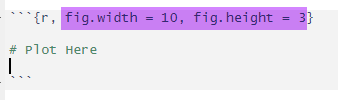
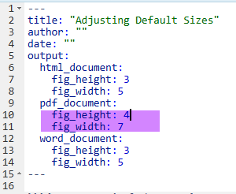

```{r, include = FALSE}
require(mosaic)
require(Lock5Data)
require(gridExtra)
require(forcats)
require(tidyverse)
require(scales) # label_wrap
require(ggforce) # for abbreviating labels

# Datasets needed
data(SalaryGender)

# Theme adjustments
theme_set(theme_classic())
```

This section will cover adjusting numeric or categorical data values on axis, legend labels, or panel (facet) labels.

```{r, echo = FALSE, warning = FALSE}
gf_boxplot(Salary~as.factor(Gender), data = SalaryGender, color = ~as.factor(PhD), width = 0.4, position= position_dodge(.5)) %>%
  gf_labs(color = "Labels\n(below)", x = "", title = "", y = "") %>%
  gf_refine(
    scale_x_discrete(labels = c("0" = "Female", "1" = "Male")),
    scale_color_manual(labels = c("0" = "No PhD", "1" = "PhD"), values = c("white", "white")),
    coord_cartesian(xlim = c(1,2))) %>%
  gf_theme(theme_classic()) %>%
  gf_facet_wrap(~PhD)
```

# Force Variable Type

Sometimes we have data that is technically numeric (e.g. Division I or Division III listed as 1 or 3) but we really want to treat it like a category.

## Force Numeric Variable to be Categorical

To force numeric data to be treated like a category, use as.factor( ).

**Example:** gf_boxplot( Rank \~ as.factor(Division), data = Dataset )

```{r, include = FALSE}
Rank = c(sample(seq(1,70), size = 40, replace = FALSE), sample(seq(20, 100), size = 40, replace = FALSE))
Division = c(rep(1, 40), rep(3, 40))
Sports = data.frame(Rank, Division)
```

```{r, warning = FALSE}
as.numeric = gf_boxplot(Rank~Division, data = Sports) %>%
  gf_labs(title = "Division as Number")
as.factor = gf_boxplot(Rank~as.factor(Division), data = Sports) %>%
  gf_labs(title = "Division as Factor", x = "Division")

grid.arrange(as.numeric, as.factor, nrow =  1)
```

## Force Categorical Variable to be Numeric

Perhaps we have data stored in dollars (e.g. \$257). R will treat this like a category, but we really want it to be treated as a number. There are a few ways to do this, but one way is to use as.numeric( ).

**Example:** gf_point( as.numeric(Price) \~ SqFt , data = Dataset )

```{r, include = FALSE}
data(AllCountries)
AdjustedCountries = AllCountries %>%
  mutate(NewPrice = as.factor(PumpPrice))
```

```{r, warning = FALSE}
factor = gf_point(NewPrice~LandArea, data = AdjustedCountries) %>%
  gf_labs(title = "Price as Factor", y = "Price", x = "Land Area")

numeric = gf_point(as.numeric(NewPrice)~LandArea, data = AdjustedCountries) %>%
  gf_labs(title = "Price as Numeric", y = "Price", x = "Land Area")


grid.arrange(factor, numeric, nrow = 1)
```

# Adjust Categorical Labels

The following Sections are specific to adjusting categorical-like data.

## Adjust labels (not data itself)

Sometimes we have categorical data stored as numeric and not only do we want to force R to treat as a factor but we also want to adjust the labels. For example, Gender is stored as 0 and 1. We want to treat as factor and make 0 and 1 more clear.

One option is to use scale_x_discrete(labels = c("0" = "F", "1" = "M")) to adjust the labels given.

**Example:** gf_plot( Y \~ X ) %\>% gf_refine( scale_x_discrete(labels = c("0" = "F", "1" = "M")) )

This will adjust what R puts on the x-axis, but it doesn't actually make Gender a factor with F and M. R Still treats it as a number. Thus, we still have to have as.factor(Gender) to get separate boxes.

```{r}
no.factor.gender = gf_boxplot(Salary~Gender, data = SalaryGender, width = 0.4, position= position_dodge(.5)) %>%
  gf_labs(x = "Gender", title = "Using scale_x_discrete Labels", subtitle = "But still treat Gender as numeric (not ideal)") %>%
  gf_refine(scale_x_discrete(labels = c("0" = "F", "1" = "M"))) 

as.factor.gender = gf_boxplot(Salary~as.factor(Gender), data = SalaryGender, width = 0.4, position= position_dodge(.5)) %>%
  gf_labs(x = "Gender", title = "Using scale_x_discrete Labels", subtitle = "And treat Gender as categorical (ideal)") %>%
  gf_refine(scale_x_discrete(labels = c("0" = "F", "1" = "M"))) 

grid.arrange(no.factor.gender, as.factor.gender, nrow = 1)
```

To adjust multiple labels, adjust your scale_XXX_discrete( ) accordingly. The example below adjusts the x axis and color labels.

```{r}
default = gf_boxplot(Salary~as.factor(Gender), data = SalaryGender, color = ~as.factor(PhD), width = 0.4, position= position_dodge(.5)) %>%
  gf_labs(color = "PhD", x = "Gender", title = "Default Labels (0 and 1)") 
  

adjusted = gf_boxplot(Salary~as.factor(Gender), data = SalaryGender, color = ~as.factor(PhD), width = 0.4, position= position_dodge(.5)) %>%
  gf_labs(color = "PhD", x = "Gender", title = "Adjust Gender & PhD Labels") %>%
  gf_refine(
    scale_x_discrete(labels = c("0" = "Female", "1" = "Male")),
    scale_color_discrete(labels = c("0" = "No PhD", "1" = "PhD")),
    coord_cartesian(xlim = c(1,2))) 

grid.arrange(default, adjusted, nrow = 1)
```

## Adjust labels by adjusting the data

Alternatively, we can recode the variable itself. This will allow R to not only treat Gender as a factor instead of as 0 and 1 but also have different (more clear) labels.

Note, you need to put the code to adjust your variable *before* the code for your graph as R will run these sequentially when you knit your document.

```{r}
SalaryGender$Gender = recode(SalaryGender$Gender, '0' = "Female", '1' = "Male")

gf_boxplot(Salary~Gender, data = SalaryGender, width = 0.4, position= position_dodge(.5)) %>%
  gf_labs(color = "PhD", x = "Gender", title = "Gender with Labels Adjusted") 

```

# Dealing with Overlapping Labels

Sometimes our categorical labels overlap and make our visuals unreadable. There are a few things we can do to adjust.

I'm using a made-up-dataset from [this](https://stackoverflow.com/questions/41568411/how-to-maintain-size-of-ggplot-with-long-labels/66169251) post.

```{r}
Labels <- c("Long label", "Longer label", "An even longer label",
        "A very, very long label", "An extremely long label",
        "Long, longer, longest label of all possible labels", 
        "Another label", "Short", "Not so short label")
LongLabels <- data.frame(Labels, CharCount = nchar(Labels))

gf_col(CharCount~Labels, data = LongLabels) %>%
  gf_labs(y = "Number of Characters in Label", x = "Really Long Label Names", title = "Difficulty with Overlapping Labels")

```

## Make Plot Wider

One way to deal with overlapping labels is merely to make the plot wider. We can do this at the R Chunk level (for a specific plot) or more globally in the Markdown settings.

**R Chunk Level:** adjust {r, fig.width = 10}



```{r, fig.width = 10}

Semi.Long.Labels <- c("Long label", "Longer label", "An even longer label", "Another label", "Short", "Not so short label")
ShorterLabels <- data.frame(Semi.Long.Labels, CharCount = nchar(Semi.Long.Labels))

gf_col(CharCount~Semi.Long.Labels, data = ShorterLabels) %>%
  gf_labs(y = "Number of Characters in Label", x = "Really Long Label Names", title = "Making Figure Wider (in R Chunk)")

```

**Globally:** adjust settings in the Markdown heading



## Adjust orientation of graph

Sometimes readability of our graph is solved by simply adjusting the orientation of our graph.

```{r}
gf_col(Labels~CharCount, data = LongLabels) %>%
  gf_labs(x = "Number of Characters in Label", y = "Really Long Label Names", title = "Adjust Orientation of Graph")
```

## Adjust Angle of Labels

We can also adjust the angle of the labels. This is not as ideal as it's harder to read labels that are not horizontal. Ideally, if we can make horizontal labels, we should do so!

To adjust angle of labels, adjust the theme element. Specify the angle, and then (possibly) where it starts horizontally (hjust).

**Example:** gf_plot( Y \~ X ) %\>% gf_theme(axis.text.x = element_text(angle = 45, hjust = 1))

```{r}
gf_col(CharCount~Labels, data = LongLabels) %>%
  gf_labs(y = "", x = "Really Long Label Names", title = "Labels at 45 Degree Angle (with hjust)") %>%
  gf_theme(axis.text.x = element_text(angle = 45, hjust = 1))

gf_col(CharCount~Labels, data = LongLabels) %>%
  gf_labs(y = "", x = "Really Long Label Names", title = "Labels at 90 Degree Angle (no hjust)") %>%
  gf_theme(axis.text.x = element_text(angle = 90))
```

## Wrap Text

Another option is to automatically wrap the text. This is most helpful if there are spaces between words.  If the words themselves are very long, this option may not work as well.

**Option 1:** Use scale_x_discrete(labels = label_wrap(10)) (from scales package)

```{r}
gf_col(CharCount~Labels, data = LongLabels) %>%
  gf_labs(y = "", x = "Really Long Label Names", title = "Wrap Labels using label_wrap", subtitle = "From scales package") %>%
  gf_refine(scale_x_discrete(labels = label_wrap(10)))
```

**Option 2:** Use str_wrap( VarName ) (from tidyverse package)

```{r}
gf_col(CharCount~str_wrap(Labels, width = 10), data = LongLabels) %>%
  gf_labs(y = "", x = "Really Long Label Names", title = "Wrap Labels using str_wrap", subtitle = "From tidyverse package")
```

## Abbreviate labels

There are a few ways we can auto-abbreviate some labels. It should be noted that the abbreviations are NOT always intuitive - so beware.  You may want to recode manually or try other options.  

**Default length (4):** scale_x_discrete(labels = abbreviate)

**Specify min length:** scale_x_discrete(labels = function(x) abbreviate(x, minlength = 1))

```{r}
Default.Abb = gf_col(CharCount~Labels, data = LongLabels) %>%
  gf_labs(y = "", x = "Abbreviated Label Names (Default)", title = "Abbreviated Labels", subtitle = "labels = abbreviate") %>%
  gf_refine(scale_x_discrete(labels = abbreviate))

MinLength.Abb = gf_col(CharCount~Labels, data = LongLabels) %>%
  gf_labs(y = "", x = "Abbreviated Label Names (Min Length = 1)", title = "Minlength Abbreviation", subtitle = "abbreviate(x, minlength = 1)") %>%
  gf_refine(scale_x_discrete(labels = function(x) abbreviate(x, minlength = 1)))

grid.arrange(Default.Abb, MinLength.Abb, nrow = 2)
```

## Dodge Labels

We can automatically dodge the labels and make them offset across multiple rows with the guide_axis(n.dodge = N) function in scale_x\_\*().  For shorter labels, we can dodge every other row (so n.dodge = 2).  For longer labels you may need to use n.dodge = 3.  Note that it may get difficult to associate the labels appropriately when n.dodge is larger than 2.  

**Example:** gf_plot( Y ~ X ) %>% gf_refine(scale_x_discrete(guide = guide_axis(n.dodge = 2))) 

```{r}
gf_sina(cty~reorder(manufacturer, displ), data = mpg, alpha = 0.4) %>%
  gf_labs(x = "Manufacturer", title = "Dodge Lables", y = "City MPG", subtitle = "n.dodge = 2") %>%
  gf_refine(scale_x_discrete(guide = guide_axis(n.dodge = 2))) 

gf_col(CharCount~Labels, data = LongLabels) %>%
  gf_refine(scale_x_discrete(guide = guide_axis(n.dodge = 3))) %>% 
  gf_labs(y = "", x = "", title = "Dodge Really Long Labels", subtitle = "n.dodge = 3")
```

Alternatively, one can try wrapping and dodging labels.

```{r}
gf_col(CharCount~str_wrap(Labels, width = 10), data = LongLabels) %>%
  gf_refine(scale_x_discrete(guide = guide_axis(n.dodge = 2))) %>% 
  gf_labs(y = "", x = "", title = "Dodge and Wrap Labels", subtitle = "n.dodge = 3, labels width = 10")
```


## Manually Recode Labels

### Adjust the labels (only) in a refine statement.

**Example:**  gf_refine(scale_x_discrete(labels = c(
                                        "Old Label 1" = "New Label 1",
                                        "Old Label 2" = "New Label 2"))) 

```{r}
gf_col(CharCount~Semi.Long.Labels, data = ShorterLabels) %>%
  gf_labs(y = "", x = "Labels Changed (But Not Data Itself)", title = "Manually Adjust the Labels") %>%
  gf_refine(scale_x_discrete(labels = c("Long label" = "Long",
                                        "Longer label" = "Longer",
                                        "An even longer label" = "Longest",
                                        "Another label" = "Another",
                                        "Short" = "Short",
                                        "Not so short label" = "Not short")))
```


### Adjust the data itself using recode.

**Example:** Dataset\$Variable = recode( Dataset\$Variable , 
                                        "Old Label 1" = "New Label 1",
                                        "Old Label 2" = "New Label 2")


```{r}
ShorterLabels$Semi.Long.Labels = recode(ShorterLabels$Semi.Long.Labels,
                                        "Long label" = "Long",
                                        "Longer label" = "Longer",
                                        "An even longer label" = "Longest",
                                        "Another label" = "Another",
                                        "Short" = "Short",
                                        "Not so short label" = "Not short")

gf_col(CharCount~Semi.Long.Labels, data = ShorterLabels) %>%
  gf_labs(y = "", x = "Recoded Labels (By Changing Data)", title = "Manually Recode Data")

```

## Adjust Font Size

This may be less-than-ideal as the font size on the axis is already relatively small, but as one last suggestion, we could adjust the font size to help overlapping labels.

theme(axis.text=element_text(size=30))

```{r, include = FALSE}
Semi.Long.Labels <- c("Semi Long label", "A really really Long label", "An even longer label", "Another label", "Short", "Not so short label")
ShorterLabels <- data.frame(Semi.Long.Labels, CharCount = nchar(Semi.Long.Labels))
```

**Example:** gf_plot( Y ~ X ) %>% gf_theme(axis.text.x=element_text(size=10))

```{r}
gf_col(CharCount~Semi.Long.Labels, data = ShorterLabels) %>% gf_theme(axis.text.x=element_text(size=7)) %>%
  gf_labs(y = "", x = "Long Labels", title = "Change Axis Text (x) Size", subtitle = "Size = 7")
```


# Adjusting Numeric Data

```{r, include = FALSE}
# Creating fake data
x = seq(1:100)
SmallError = runif(100, min = -10000000, max = 10000000)
LargeError = runif(100, min = -100000000, max = 100000000)
LargeNumbers = x*1000000 
NumData = data.frame(LargeNumbers, x, RandLargeNum = LargeNumbers + SmallError, OtherLargeNum = LargeNumbers + LargeError)
```

This section explores ways to adjust numeric scale display.  This will largely use the [scales package](https://scales.r-lib.org/).

To illustrate some ways to adjust numeric data, we'll start with a plot (below) that defaults to scientific notation

```{r}

gf_point(RandLargeNum~x, data = NumData) %>%
  gf_labs(y = "", x = "", title = "Default: Scientific Notation (y-axis)")

```

## Mathematically Adjust Data

One can mathematically adjust the data to take on a slightly different form.  If we do so, we'll want to adjust our labels accordingly for better readability.

**Example:** gf_plot( Population/1000000 ~ LifeExpectancy, data = Dataset ) 
  %>% gf_labs( y = "Population (Millions)")

```{r}
gf_point(RandLargeNum/1000000~x, data = NumData) %>%
  gf_labs(y = "Values (Millions)", x = "", title = "Mathematically Adjust Large Numbers")
```


## Number & Comma Notation

You can adjust the default notation and force the scale to be a number using the [label_number](https://scales.r-lib.org/reference/label_number.html) command.

```{r}
gf_point(RandLargeNum~x, data = NumData) %>%
  gf_refine(scale_y_continuous(labels = label_number())) %>%
  gf_labs(y = "", x = "", title = "Adjust y-axis to number notation", subtitle = "Better than scientific notation, but rather long")
```

To specifically add a comma (instead of a space) one can use [label_comma()](https://scales.r-lib.org/reference/label_number.html).  

**Example:** gf_refine( scale_y_continuous( labels = label_comma() ) )

```{r}
gf_point(RandLargeNum~x, data = NumData) %>%
  gf_refine(scale_y_continuous(labels = label_comma())) %>%
  gf_labs(y = "", x = "", title = "Adjust y-axis to comma notation", subtitle = "Better than scientific notation, but rather long")
```

To adjust the rather long numeric labels, you can adjust the scale within the label_comma command.  Additionally, you can add prefix and suffix labels.

```{r}
gf_point(RandLargeNum~x, data = NumData) %>%
  gf_refine(scale_y_continuous(labels = label_comma(scale = 1/1000000, suffix = "M", prefix = "$"))) %>%
  gf_labs(y = "", x = "", title = "Adjust y-axis to Comma notation", subtitle = "Also adjust scale, suffix, and prefix")
```

Another option is scale_cut() option. This can automatically adjust numbers and add a suffix (e.g. K, M, B).  This works particularly well for log scales.  This option works both within label_number and label_comma.  

**Example:** gf_refine(scale_y_continuous( labels = scales::label_number(scale_cut = scales::cut_short_scale())))

```{r}
gf_point(RandLargeNum~x, data = NumData) %>%
  gf_refine(scale_y_continuous( labels = scales::label_comma(scale_cut = scales::cut_short_scale()))) %>%
  gf_labs(y = "", x = "", title = "cut_short_scale( ) Adjustments")
```

## Adding $ or % to Numbers

Instead of adding a \$ as a prefix within the label_number or label_comma commands, you can use label_dollar.  You can still specify the scale and suffix even within label_dollar. 

**Example:** gf_refine(scale_y_continuous( labels = scales::label_dollar(scale = 1/1000000, suffix = "M")))

```{r}
gf_point(RandLargeNum~x, data = NumData) %>%
  gf_refine(scale_y_continuous( labels = scales::label_dollar(scale = 1/1000000, suffix = "M"))) %>%
  gf_labs(y = "", x = "", title = "label_dollar with scale & suffix (y-axis)")
```

Additionally, instead of adding a \% sign a a suffix, we can use [label_percent](https://scales.r-lib.org/reference/label_percent.html).

**Example:** gf_refine(scale_x_continuous(labels = label_percent()))

```{r}
gf_point(RandLargeNum~x, data = NumData) %>%
  gf_refine(scale_y_continuous( labels = scales::label_dollar(scale = 1/1000000, suffix = "M")),
            scale_x_continuous(labels = label_percent(scale = 1))) %>%
  gf_labs(y = "", x = "", title = "label_dollar (y-axis) and label_percent (x-axis)")
```


## Other Number Elements

The scales package has many other abilities, described in detail in the [references](https://scales.r-lib.org/reference/index.html) page.  Some highlights include:

- [label_bytes()](https://scales.r-lib.org/reference/label_bytes.html) (1kB, 2 MB)
- [label_currencies](https://scales.r-lib.org/reference/label_currency.html) ($100, €2.50)
- [label_ordinal](https://scales.r-lib.org/reference/label_ordinal.html) (1st, 2nd, 3rd, etc)
- [label_pvalue](https://scales.r-lib.org/reference/label_pvalue.html) (p <0.001, p = 0.25, p >= 0.99)
- [label_scientific](https://scales.r-lib.org/reference/label_scientific.html) (1e05, 1.5e-02)


## Categorical Labels for Numbers

If you'd like to add categorical labels to the numeric values, you can do so inside the scale_\*_continuous command using the labels option.  

```{r}
gf_histogram(~price, data = diamonds) %>%
  gf_labs(title = "Adding Labels to Price Breaks", y = "", x = "Price Labels") %>%
  gf_refine(scale_x_continuous(breaks = c(0, 4000, 8000, 12000, 16000),
                               labels = c("Free", "Typical", "Expensive", "Really\nExpensive", "Astronomical")),
            scale_y_continuous(breaks = c(0,7500,15000), minor_breaks = seq(0,20000, by = 2000))) %>%
  gf_theme(theme_minimal())
```

