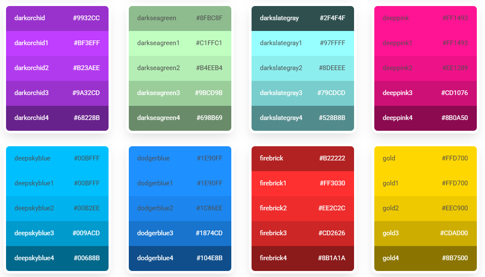
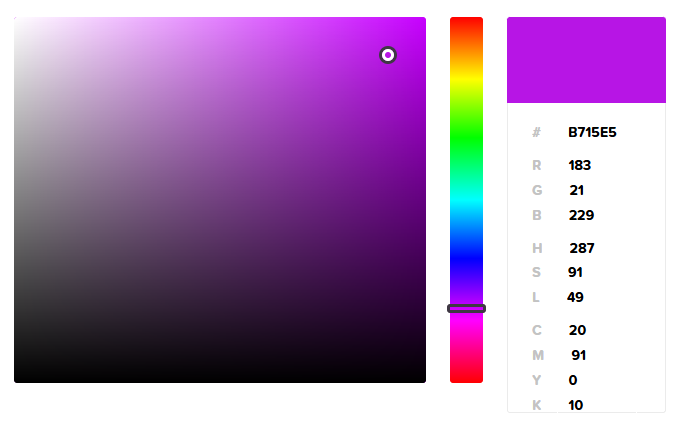
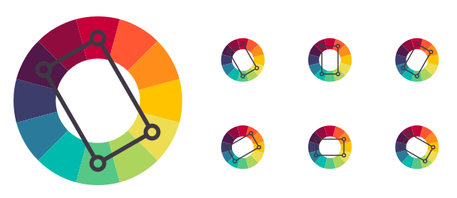
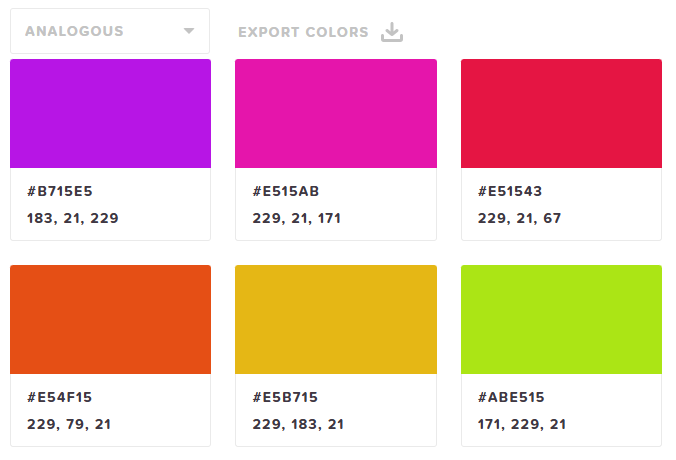
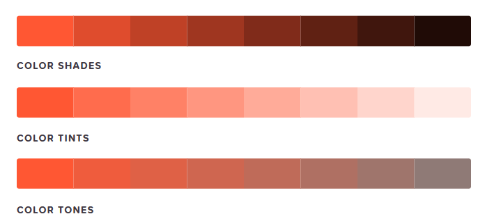
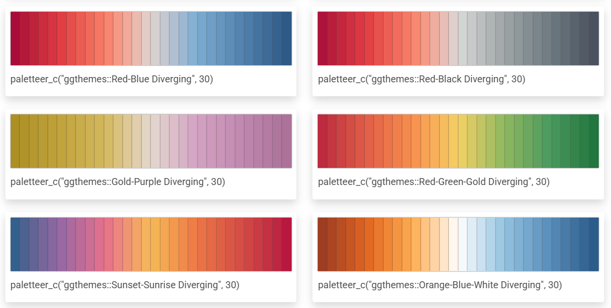

```{r, include = FALSE}
require(mosaic)
require(mosaicData)
require(Lock5Data)
data(SalaryGender)
data("BaseballSalaries2019")
require(gridExtra)
theme_set(theme_minimal())
require(forcats)
require(MASS)
require(viridis)
require(scales)
require(tidyr)
require(ggrepel)
require(maps)
data(world.cities)
data("MarriageAges")
library(ggpubr)
require(ggrepel)
require(ggmosaic)
require(palmerpenguins)
require(ggformula)
require(ggridges)
require(readr)
require(socviz)
require(stringr)
require(paletteer) # palettes
require(RColorBrewer) # palettes
require(colorspace)

data(fly)
fly = na.omit(fly)

data("penguins")
penguins = na.omit(penguins)

data("gss_sm")
gss_sm = na.omit(gss_sm)
require(gapminder)
require(ggplot2)
data("Birthdays")
```

In this section I've separated out how to choose individual colors & palettes. This is a repository of things about how to choose color that I found helpful but does not go into details on how specifically to adjust color within a graph.

# Picking Individual Colors

R understands many different colors that can be specified with a color name (you just have to know the color name!). The colors() command will list ALL colors, but it doesn't show you those colors.

```{r}
colors()[1:10]
```

Here is a sample table of colors with their color name (hard to read, but just for illustrative purposes the variety of colors - and this just scratches the surface)!

```{r, echo = FALSE}
line = 25
col = 5

y = sort(rep(1:line, col), decreasing = F)
x = rep(1:col, line)
z = seq(from = 1, to =col*line, by = 1)
col.list = colors()[z]

gf_tile(y~x, fill=~as.factor(z), show.legend = FALSE) %>%
  gf_refine(scale_fill_manual(values = c(colors()[z])),
            scale_y_reverse()) %>%
  gf_text(y~x, label = col.list, size = 2) %>%
  gf_theme(theme_void())


```

The above table is hard to read, so I love how this [website](https://r-charts.com/colors/) groups & orders all colors, providing not only the name of the color but also the hex code.

{width="699"}

## Color Picker Website

This [color picker](https://htmlcolorcodes.com/color-picker/) allows you to pick any color, gives the hex code and the rgb codes. If you don't know a color name - not to worry! R understands hex codes and rgb codes.

{width="400"}

Some things I really like about this website:

-   It goes through some color theory,

-   gives additional color options based on your color theory elements

-   and provides sequential palette ideas based on shades, tints, and tones of a color of your choice.

{width="200"} {width="128"} {width="191"}

# Palettes of Color

What is a palette? A palette of colors is a pre-selected collection of colors you can use to plot.

This [chapter](https://bookdown.org/pdr_higgins/rmrwr/colors-and-scales-in-ggplot2.html) created a function to plot any manual palette of colors you choose.

```{r, echo = FALSE}

plot_palette <- function(palette) {
  g <- ggplot2::ggplot(
    data = data.frame(
      x = seq_len(length(palette)),
      y = "1",
      fill = palette
    ),
    mapping = ggplot2::aes(
      x = x, y = y, fill = fill
    )
  ) +
    ggplot2::geom_tile() +
    ggplot2::scale_fill_identity() +
    ggplot2::theme_void()
  return(g)
}

plot_palette(c("#FFCB05", "#00274C", "#00B2A9", "#2F65A7", "#702082"))

```

Although you can manually select colors you wish, there are MANY different pre-made palettes - and I imagine they will just continue to keep making more. This will never be an exhaustive list - but at the time of writing this is a collection of several, but I currently tend toward manual, brewer, and viridis palettes.

## Brewer

The Brewer palettes have some commands where you can see all the palettes (examples below). I like how Jose M Sallan put things together in [this](https://jmsallan.netlify.app/blog/the-brewer-palettes/) post. The palettes look great, are organized well, and nicely labeled so you know how to use a specific palette in your code.

Here are a few examples of the display functions that show some of the colorblind friendly palettes.

```{r, fig.height=9}
display.brewer.all(type="seq", colorblindFriendly = TRUE)
```

```{r}
display.brewer.all(type="div", colorblindFriendly = TRUE)
display.brewer.pal(n = 8, name = 'Dark2')
```


A site that Sallan mentions is [this](https://colorbrewer2.org/#type=sequential&scheme=BuGn&n=3) one where you can see the Brewer palettes in action.

## Viridis

[Jose M Sallan](https://jmsallan.netlify.app/blog/the-viridis-palettes/) does it again with an awesome display of the viridis palettes.  

### Continuous Scale

```{r, echo  = FALSE}
viridis_names <-c("magma", "inferno", "plasma", "viridis", "cividis", "rocket", "mako", "turbo")

n <- 50
par(mfrow=c(4,2), mar = c(1,1,1,1))
f <- sapply(1:8, function(x) image(matrix(1:n, n, 1), col = viridis(n=n, option = LETTERS[x]), axes =FALSE, main = viridis_names[x]))
```

### Discrete Scale

```{r, echo  = FALSE}
n <- 8
par(mfrow=c(4,2), mar = c(1,1,1,1))
f <- sapply(1:8, function(x) image(matrix(1:n, n, 1), col = viridis(n=n, option = LETTERS[x]), axes =FALSE, main = viridis_names[x]))
```

This [site](https://waldyrious.net/viridis-palette-generator/) allows you to pick the number of categories and viridis palette & gives rgb and hex codes for the colors used.

This [post](https://cran.r-project.org/web/packages/viridis/vignettes/intro-to-viridis.html) goes over some documentation and images that compare the viridis scale to other commonly used color scales with different color deficiencies.

Here is the [ggplot2](https://ggplot2.tidyverse.org/reference/scale_viridis.html) page of viridis palette uses.

## Colorspace

Read more about [colorspace](https://colorspace.r-forge.r-project.org/reference/hcl_palettes.html) palettes. They have several commands that allow for interactive color-choosing experiences within your Shiny app and occasionally your html viewer.

```{r}
#hcl_palettes("qualitative", plot = TRUE)
#hcl_palettes("sequential (single-hue)", n = 7, plot = TRUE)
hcl_palettes("sequential (multi-hue)", n = 7, plot = TRUE)
#hcl_palettes("diverging", n = 7, plot = TRUE)

# Pop up selector
#choose_palette()
#demo("viridis", package = "colorspace")
```

## Paletteer

[Paletteer](https://emilhvitfeldt.github.io/paletteer/) aims to be a repository of all palettes, and can display in this way:

```{r}
paletteer_d("awtools::mpalette")
#paletteer_d("awtools::ppalette")
#paletteer_d("nord::frost")
```

The [color palette finder](https://r-graph-gallery.com/color-palette-finder) is another way to not only see a snippet of the palette (in the drop down menu) but also see the palette applied to several types of graphs (to see the palette in action!). Alternatively, [R Charts](https://r-charts.com/color-palettes/#continuous) shows snippets of 497 palettes.

{width="794"}

# Accessibility

An additional resource that I've found helpful is [this](https://www.color-blindness.com/coblis-color-blindness-simulator/) website that allows you to upload your image and see how it looks with different color deficiencies.  
