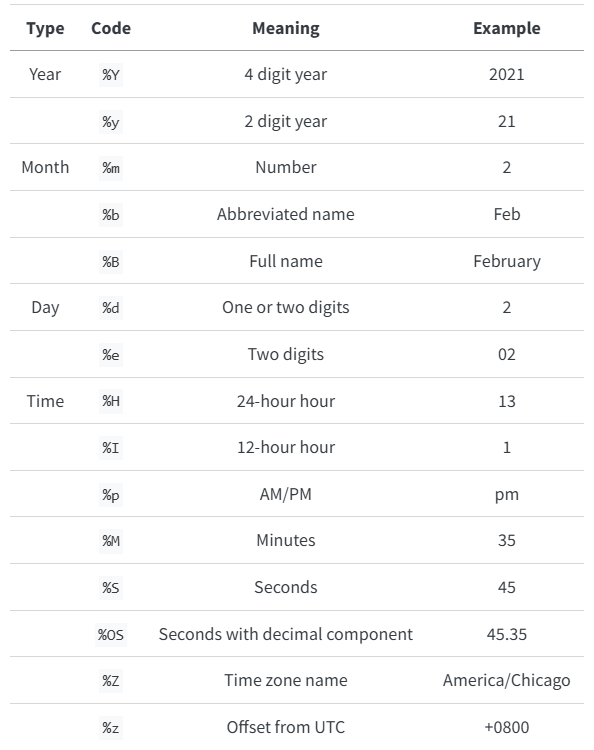

```{r, include = FALSE}
require(mosaic)
require(mosaicData)
require(Lock5Data)
data(SalaryGender)
data("BaseballSalaries2019")
require(gridExtra)
theme_set(theme_minimal())
require(forcats)
require(MASS)
require(viridis)
require(scales)
require(tidyr)
require(ggrepel)
require(maps)
data(world.cities)
data("MarriageAges")
library(ggpubr)
require(ggrepel)
require(ggmosaic)
require(palmerpenguins)
require(ggformula)
require(ggridges)
require(readr)
require(socviz)
require(stringr)
require(paletteer) # palettes
require(RColorBrewer) # palettes
require(colorspace)

data(fly)
fly = na.omit(fly)

data("penguins")
penguins = na.omit(penguins)

data("gss_sm")
gss_sm = na.omit(gss_sm)
require(gapminder)
require(ggplot2)
data("Birthdays")
require(openintro)
require(Stat2Data)
require(nycflights13)
require(lubridate)

data(Kershaw)
Kershaw2 = Kershaw %>%
  mutate(Time = ymd_hms(Time))

flights_time = flights %>%
  mutate(DeptTime = as.POSIXct(paste0(year,"-",month,"-",day, " ", hour,":",minute), format = "%Y-%m-%d %H:%M")) 

data(KeyWestWater)
KeyWestWater2 = KeyWestWater %>%
  mutate(DateTime = mdy_hm(DateTime))
```

In my experience - time variables can be tricky to work with. They are not quite numbers and not quite strings. Sometimes time variables work as we might expect, and sometimes they don't. Depending on the specific format and what you're looking to do - you may need to come up with some creative work-arounds. Below I'll outline some general adjustments - but I have not had these work in ALL cases I've tried. If you are experiencing frustrations working with time variables - I feel your pain!

The package most helpful for adjusting dates (that I have found) is lubridate.

# Adjusting Axis Range

To adjust your axis range, if your variables are in a nice format that are easily read as POSIXct values, you may be able to adjust your axis range using [scale_x_datetime()](https://ggplot2.tidyverse.org/reference/scale_date.html) limits. Otherwise, you may need to find creative workarounds by subsetting your data.

## Refine Limits

If your variables are POSIXct or Date variables, you may be able to adjust your limits using scale_x_datetime() limits. Below are a couple of examples refining limits using scale_x_datetime() limits.

**Example (POSIXct):** gf_refine(scale_x_datetime(limits = as.POSIXct(c("1985-01-01", "1986-01-01"))))

**Example (Date):** gf_refine(scale_x_date(limits = as.Date(c("2016-01-01", "2017-01-01"))))

```{r, warning=FALSE}
gf_line(births~date, data = Birthdays, stat = "summary") %>%
  gf_labs(title = "All Dates")

gf_line(births~date, data = Birthdays, stat = "summary") %>%
  gf_refine(scale_x_datetime(limits = as.POSIXct(c("1985-01-01", "1986-01-01")))) %>%
  gf_labs(title = "Adjust using as.POSIXct Limits")

gf_linerange(low_temp+high_temp~date, data = subset(Weather, city == "Chicago"))  %>%
  gf_labs(title = "All Dates")

gf_linerange(low_temp+high_temp~date, data = subset(Weather, city == "Chicago")) %>%
  gf_refine(scale_x_date(limits = as.Date(c("2016-01-01", "2017-01-01")))) %>%
  gf_labs(title = "Adjust using as.Date Limits")

gf_linerange(StartSpeed+EndSpeed~Time, data = Kershaw2, size = 2, alpha = 0.6, color = ~Nasty) %>%
  gf_refine(scale_x_datetime(limits = as.POSIXct(c("2013-04-01 16:00:00", "2013-04-01 19:15:04"))),
            scale_color_viridis(option = "turbo")) %>%
  gf_labs(title = "Adjust Date & Time")
```

## Subsetting Data Workarounds

If you want to pass a date/time value into R, you can use something like as.POSIXct("YYYY-MM-DD") or as.Date("YYYY-MM-DD").

Alternatively, you can extract items of a date using year(), month(), day(), hour(), minute() etc. commands and subset based on those. Below are a few alternatives to subsetting time varaibles.

```{r, warning=FALSE}
gf_line(births~date, data = subset(Birthdays, year(date) == 1985), stat = "summary") %>%
  gf_labs(title = "Use year(DateVar) to subset by year")

gf_point(dep_delay~DeptTime, data = subset(flights_time, DeptTime > as.POSIXct("2013-07-01") & DeptTime < as.POSIXct("2013-07-02")), size = ~air_time, alpha = 0.2) %>%
  gf_labs(title = "Use as.POSIXct() to enter date values")

gf_linerange(StartSpeed+EndSpeed~Time, data = subset(Kershaw2, month(Time) == 4 & day(Time) == 1), size = 2, alpha = 0.6, color = ~Nasty) %>%
  gf_refine(scale_color_viridis(option = "turbo")) %>%
  gf_labs(title = "Subset by Month & Day")

gf_point(time~year, data = subset(nyc_marathon, hour(time) < 3 & minute(time) < 30), color = ~division, shape = ~division) %>%
  gf_labs(title = "Subset by Hour & Minute")

gf_tile(day(DateTime)~hour(DateTime), data = subset(KeyWestWater2, month(DateTime) == 10 & year(DateTime) == 2016), fill = ~WaterTemp) %>%
  gf_refine(scale_y_reverse(breaks = seq(from = 3, to = 31, by = 2))) %>%
  gf_labs(title = "October Water Temps", y = "Day", x = "Hour")
```

# Adjusting Date Breaks

Within your scale_x_datetime or scale_y_datetime options, you can specify the major and/or minor date breaks. [Chapter 10](https://ggplot2-book.org/scales-position.html#sec-date-scales) of the ggplot2 book goes over some other examples.

**Example (Major Breaks only):** scale_x_datetime(date_breaks = "3 years")

**Example (with Minor Breaks):** scale_x_datetime(date_breaks = "1 week", minor_breaks = "1 day")

**Example using [Pretty Dates](https://scales.r-lib.org/reference/breaks_pretty.html):** scale_x_datetime(breaks = breaks_pretty(25))

```{r, warning=FALSE}
gf_line(births~date, data = Birthdays, stat = "summary") %>%
  gf_labs(title = "Default Breaks")

gf_line(births~date, data = Birthdays, stat = "summary") %>%
  gf_refine(scale_x_datetime(date_breaks = "3 years"))  %>%
  gf_labs(title = "Major Breaks: 3 Years")

gf_line(births~date, data = Birthdays, stat = "summary") %>%
  gf_refine(scale_x_datetime(date_breaks = "3 years", minor_breaks = "1 year")) %>%
  gf_labs(title = "Major Breaks: 3 Years, Minor Breaks: 1 Year")

gf_line(births~date, data = subset(Birthdays, year == 1985 & month == 6), stat = "summary") %>%
  gf_refine(scale_x_datetime(date_breaks = "1 week", minor_breaks = "1 day")) %>%
  gf_labs(title = "Major Breaks: 1 Week, Minor Breaks: 1 Day")
```

# Adjusting Date Labels

[Chapter 17](https://r4ds.hadley.nz/datetimes.html#tbl-date-formats) in R for Data Science has a really nice table of all labels.



Although I really like the above table, it doesn't include all values. Others that are mentioned in the ggplot2 book include things like am/pm and day of the week.


When in doubt, look up strptime in the help window to see all values!

Within your scale_x_datetime() command you can specify the date_labels using the strptime codes. Note that scale_x_datetime() works for POSIXct and Dates. If you notice it isn't cooperating, you may try forcing variables to be read as POSIXct and then adjusting the labels.

**Example (4-Digit Year Only):** scale_x_datetime(date_labels = "%Y")

**Example (Span Multiple Lines):** scale_x_datetime(date_labels = "%b\n%Y")

**Example using Scales Date Labels:** scale_x_datetime(breaks = breaks_pretty(25), labels = label_date_short())

```{r, warning = FALSE}
gf_line(births~date, data = Birthdays, stat = "summary") %>%
  gf_refine(scale_x_datetime(date_labels = "%y")) %>%
  gf_labs(title = "Two Digit Year Labels")

gf_line(births~date, data = Birthdays, stat = "summary") %>%
  gf_refine(scale_x_datetime(date_breaks = "3 years", date_labels = "%Y")) %>%
  gf_labs(title = "Four Digit Year Labels")

gf_line(births~date, data = Birthdays, stat = "summary") %>%
  gf_refine(scale_x_datetime(limits = as.POSIXct(c("1985-01-01", "1986-01-01")),
                             date_breaks = "3 months", minor_breaks = "1 month", date_labels = "%b %y"))  %>%
  gf_labs(title = "Month & Year Labels")

gf_line(births~date, data = Birthdays, stat = "summary") %>%
  gf_refine(scale_x_datetime(limits = as.POSIXct(c("1985-01-01", "1986-01-01")),
                             date_breaks = "3 months", minor_breaks = "1 month", date_labels = "%b\n%Y"))  %>%
  gf_labs(title = "Month & Year on Separate Line Labels")

gf_line(births~date, data = Birthdays, stat = "summary") %>%
  gf_refine(scale_x_datetime(limits = as.POSIXct(c("1985-01-01", "1986-01-01")),
                             date_breaks = "1 month", minor_breaks = "1 month", date_labels = "%b"))  %>%
  gf_labs(title = "Abbreviated Month Labels")

gf_line(births~date, data = Birthdays, stat = "summary") %>%
  gf_refine(scale_x_datetime(limits = as.POSIXct(c("1985-01-01", "1986-01-01")),
                             date_breaks = "2 months", minor_breaks = "1 month", date_labels = "%B"))   %>%
  gf_labs(title = "Full Month Labels")

gf_line(births~date, data = subset(Birthdays, year == 1985 & month == 6), stat = "summary") %>%
  gf_refine(scale_x_datetime(date_breaks = "1 week", minor_breaks = "1 day", date_labels = "%b %d"))  %>%
  gf_labs(title = "Month & Day Labels")

gf_line(births~date, data = subset(Birthdays, year == 1985 & month == 6), stat = "summary") %>%
  gf_refine(scale_x_datetime(date_breaks = "1 week", minor_breaks = "1 day", date_labels = "%a %d")) %>%
  gf_labs(title = "Day of Week & Day (number) Labels")

gf_line(births~date, data = subset(Birthdays, year == 1985 & month == 6), stat = "summary") %>%
  gf_refine(scale_x_datetime(breaks = breaks_pretty(5), minor_breaks = "1 day", date_labels = "%a"))   %>%
  gf_labs(title = "Just Day of the Week Labels")

gf_line(births~date, data = subset(Birthdays, year == 1985 & month == 6), stat = "summary") %>%
  gf_refine(scale_x_datetime(breaks = breaks_pretty(25), labels = label_date_short()))   %>%
  gf_labs(title = "Auto-Created Short Labels")
```

```{r, warning = FALSE}
gf_point(time~year, data = nyc_marathon, color = ~division, shape = ~division) %>%
  gf_labs(title = "Default Time Labels")

gf_point(as.POSIXct(time)~year, data = nyc_marathon, color = ~division, shape = ~division) %>%
  gf_refine(scale_y_datetime(date_labels = "%H:%M")) %>%
  gf_labs(title = "Adjust Hour & Minute Labels", y = "Time")
```

```{r, warning = FALSE}
gf_point(dep_delay~time_hour, data = flights, alpha = 0.1) %>%
  gf_refine(scale_x_datetime(limits = as.POSIXct(c("2013-07-01", "2013-08-01")),
                             date_breaks = "1 day",
                              date_labels = "%d")) %>%
  gf_labs(title = "Day of Month Labels")

gf_point(dep_delay~DeptTime, data = subset(flights_time, DeptTime > as.POSIXct("2013-07-01") & DeptTime < as.POSIXct("2013-07-02")), size = ~air_time, alpha = 0.2) %>%
  gf_refine(scale_x_datetime(date_labels = "%l:%M\n%p",
                             date_breaks = "2 hours")) %>%
  gf_labs(title = "Hour & AM/PM Labels")
```

```{r, warning = FALSE}
gf_linerange(low_temp+high_temp~date, data = subset(Weather, city == "Chicago"), color = ~avg_temp) %>%
  gf_refine(scale_color_viridis(option = "turbo"),
            scale_x_date(date_breaks = "2 months",
                         labels = label_date_short()))


gf_linerange(low_temp+high_temp~date, data = subset(Weather, city == "Chicago"), color = ~avg_temp) %>%
  gf_refine(scale_color_viridis(option = "turbo"),
            scale_x_date(limits = as.Date(c("2016-01-01", "2017-01-01")),
                         date_breaks = "1 month",
                         date_labels = "%b"))
```

# Extracting Functions From Dates

```{r, include = FALSE}
data("Births2015")
weekdays(Births2015$date)
month(Births2015$date, label = TRUE)
```

In this example, although weekday is a variable in the dataset, I wanted to see about using the weekdays() function to extract weekday from a date.  Turns out you can! 

## Weekdays

**Example (Weekday Full):**  weekdays(Date)

**Example (Weekday Abbreviated):** weekdays(Date, abbreviate = TRUE)

```{r}
gf_line(births~date, data=Births2015, col = ~weekdays(date)) %>%
  gf_labs(title = "Color by Weekday Extracted from Date")
gf_line(births~date, data=Births2015, col = ~weekdays(date, abbreviate = TRUE)) %>%
  gf_labs(title = "Colro by Abbreviated Weekday from Date")

gf_line(births~date, data=Births2015, col = ~weekdays(date)) %>%
  gf_theme(legend.position = "none") %>%
  gf_lims(x=c(as.Date("2015-01-01"), as.Date("2016-01-05"))) %>%
  gf_labs(y = "Number of Births", x = "", title = "Direct Labels using ggrepel") +
  geom_text_repel(data = subset(Births2015, date > as.Date("2015-12-24")), aes(label = weekdays(date, abbreviate = TRUE)), direction = "y", hjust = -1, segment.color = "gray60")

```
## Week of Month

Ultimately, I wanted to be able to make mini-calendars for each month to see births.  Here is my progression to what I was looking for.

Although we were able to get week of the year and weekday - weekday is in alphabetical order and Sunday is counted in the previous week.  

```{r}
gf_tile(strftime(date, format = "%V")~weekdays(date, abbreviate = TRUE), data = Births2015, fill = ~births) %>%
  gf_facet_wrap(~month(date, abbr = TRUE, label = TRUE), scales = "free_y") %>%
  gf_refine(scale_y_discrete(limits = rev)) %>%
  gf_theme(axis.text.y = element_blank()) %>%
  gf_labs(title = "Default Weekday Order is Alphabetical")
```

Here you can see we at least fixed the weekday order using the ordered factor wday within the dataset.  Alteternatively, I could have created a weekday factor and then specified the order I wanted.  This was just easier since they did that work for us.

```{r}
gf_tile(strftime(date, format = "%V")~wday, data = Births2015, fill = ~births) %>%
  gf_facet_wrap(~month(date, abbr = TRUE, label = TRUE), scales = "free_y") %>%
  gf_refine(scale_y_discrete(limits = rev)) %>%
  gf_theme(axis.text.y = element_blank()) %>%
  gf_text(label = ~day(date), color = "white", size = 2)
```


Next, I wanted to shift Sundays to the "next" week.  So I created a numeric variable that was dependent on Weekday and recreated the calendars with the appropriate orders now.

```{r}
ShiftedBirths = Births2015 %>%
  mutate(WeekOfMonth = ifelse(weekdays(Births2015$date) == "Sunday", as.numeric(strftime(date, format = "%V"))+1, as.numeric(strftime(date, format = "%V"))))

gf_tile(WeekOfMonth~wday, data = ShiftedBirths, fill = ~births) %>%
  gf_facet_wrap(~month(date, abbr = TRUE, label = TRUE), scales = "free_y") %>%
  gf_refine(scale_y_reverse(),
            scale_x_discrete(labels = function(x) abbreviate(x, minlength = 1))) %>%
  gf_theme(axis.text.y = element_blank()) %>%
  gf_text(label = ~day(date), color = "white", size = 2)
```


Next, I wanted to shorten the labels for days of the week so I could read them a little better.  Many other ways we coudl have done this, I just chose to shorten to 1ish characters which seemed fine for me.  I also wanted to just practice putting the full Month labels (if we ever wanted full month labels) - so I updated those too.

```{r}
gf_tile(WeekOfMonth~wday, data = ShiftedBirths, fill = ~births) %>%
  gf_facet_wrap(~month(date, label = TRUE, abbr = FALSE), scales = "free_y") %>%
  gf_refine(scale_y_reverse(),
            scale_x_discrete(labels = function(x) abbreviate(x, minlength = 1))) %>%
  gf_theme(axis.text.y = element_blank()) %>%
  gf_text(label = ~day(date), color = "white", size = 2)

```

Just for kicks adding a different color scale.  This wasn't necessary - I just wanted to adjust.

```{r}
gf_tile(WeekOfMonth~wday, data = ShiftedBirths, fill = ~births) %>%
  gf_facet_wrap(~month(date, label = TRUE, abbr = FALSE), scales = "free_y") %>%
  gf_refine(scale_y_reverse(),
            scale_x_discrete(labels = function(x) abbreviate(x, minlength = 1)),
            scale_fill_viridis(option = "plasma")) %>%
  gf_theme(axis.text.y = element_blank()) %>%
  gf_text(label = ~day(date), color = "white", size = 2)
```

## Convert Month Number to Abbreviation

In the Birthdays dataset, we are given month as a number but ideally we'd want month to be ordered & have labels.  I used the month.abb[] option below to have R define month labels for me.  I could have just created these, but if it's a function already - easier to have R do it than us code unnecessarily.

**Month Number to Abbreviation:** month.abb[month]

**Force Chronological Order (not Alphabetical):** factor(month.abb[month], levels = month.abb)

Super Simple illustration:

```{r}
month.num = seq(1:12) # Create vector of month values 1 to 12
abbMonth = month.abb[month.num] # See that they now display month names
abbMonth
gf_bar(~abbMonth) # But if we use them as a variable, they're in alphabetical order
gf_bar(~factor(abbMonth, levels = month.abb)) # So force the order by specifying levels
gf_bar(~factor(month.name[month.num], levels = month.name)) # Just for kicks - trying out month.name instead
```

```{r, include = FALSE}
BirthdaysSum = Birthdays %>%
  group_by(month, day) %>%
  mutate(TotalBirths = sum(births),
         AveBirths = mean(births)) %>%
  subset(TotalBirths > 300) %>%
  dplyr::select(month, day, TotalBirths, AveBirths) %>%
  unique()

```

Suppose you have a color palette you want to apply to your graph.

```{r, echo = FALSE}
colors = c("#FFFCF8", "#FBE0DD", "#FBC6C0", "#F89DB7", "#F068A0", "#DF3094", "#AD2081", "#782777", "#4A236B")
gf_tile(factor(month.abb[month], levels = month.abb)~day, data = subset(BirthdaysSum, TotalBirths > 300), fill=~AveBirths, color = "gray95", size = 0.05) %>%
  gf_refine(scale_fill_gradientn(na.value = NA,
                                colors = colors,
                                values = c(0, 0.45, 0.55, 0.65, 0.77, 0.82, 0.95, 1),
                               labels = label_number(scale_cut = cut_short_scale())),
            coord_fixed(expand = FALSE),
            scale_y_discrete(limits = rev),
            scale_x_continuous(breaks = seq(from = 1, to = 31, by = 1))) %>%
  gf_theme(legend.position = "top",
           panel.grid.major.x = element_blank(),
           panel.grid.major.y = element_blank(),
           panel.grid.minor.x = element_blank(),
           panel.grid.minor.y = element_blank()) %>%
  gf_theme(guides(fill = guide_colorsteps(even.steps = FALSE, barwidth = 20)))  %>%
  gf_labs(fill = "Average Daily Births", y = "", x = "")
```


