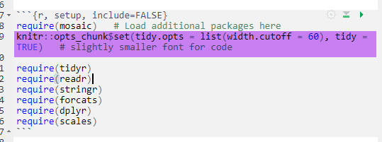

The following items are miscellaneous tips or ideas to help with formatting your Markdown document. Additional resources include [R Markdown: The Definitive Guide](https://bookdown.org/yihui/rmarkdown/)

# Wrap code for PDF documents

Sometimes you'll notice after you knit your document (especially to PDF) that your code is not all visible. To fix this, add the following in the beginning R Chunk:

knitr::opts_chunk\$set(tidy.opts = list(width.cutoff = 60), tidy = TRUE)

# Table of Contents

To Add a table of contents to your markdown document, use toc: TRUE in your title headings.

