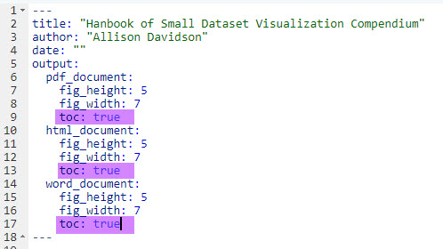
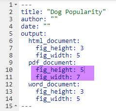
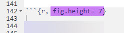

The following items are miscellaneous tips or ideas to help with formatting your Markdown document. Additional resources include [R Markdown: The Definitive Guide](https://bookdown.org/yihui/rmarkdown/)

# Wrap code for PDF documents

Sometimes you'll notice after you knit your document (especially to PDF) that your code is not all visible. To fix this, add the following in the beginning R Chunk:

knitr::opts_chunk\$set(tidy.opts = list(width.cutoff = 60), tidy = TRUE)

# Table of Contents

To Add a table of contents to your markdown document, use toc: TRUE in your title headings.

# Adjusting Figure Size

There are two main ways to adjust the figure size in a Markdown. One is to adjust all figures within a specific type of document (e.g. PDF). Another is to adjust the figure size of all figures within a specific R Chunk.

## Global Figure Size Adjustment

To adjust the figure size globally, you can specify figure height & width within the top portion of your markdown. The default is a figure height of 3 and width of 5.

## Figure Size Adjustment for Specific R Chunk

Alternatively, you can adjust specific figures within an R Chunk by specifying the figure height or width in the R Chunk settings.

