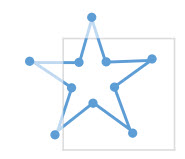

```{r, include = FALSE}
require(mosaic)
require(Lock5Data)
data(SalaryGender)
require(gridExtra)
theme_set(theme_minimal())
```

There are 2 ways of adjusting scales (in terms of how they treat data). One way is called "without clipping" where all data is preserved, but we adjust the axis to essentially zoom in or out while keeping all data preserved. Alternatively, we can adjust "with clipping" where all data not in the area specified is no longer accounted for. This will matter if you're overlaying things like linear model trendlines. The images below come from the ggplot2 cheat-sheet and I think illustrate things well.

 

# Adjust Scales Without Clipping

To adjust scales without removing unseen data points, use a gf_refine( ) statment with coord_cartesian( ) specifications.

%\>% gf_refine(coord_cartesian(xlim = c(0, 100), ylim = c(10, 20)))


## Example Without Clipping

```{r}
original = gf_point(Salary~Age, data = SalaryGender, color = ~as.factor(PhD)) %>%
  gf_labs(color = "PhD", title = "All Data") %>%
  gf_refine(scale_color_discrete(labels = c("0" = "No PhD", "1" = "PhD"))) %>%
  gf_lm()

noclipping = gf_point(Salary~Age, data = SalaryGender, color = ~as.factor(PhD)) %>%
  gf_labs(color = "PhD", title = "Zoom In Without Clipping") %>%
  gf_refine(
    scale_color_discrete(labels = c("0" = "No PhD", "1" = "PhD")),
    coord_cartesian(xlim = c(40, 80))) %>%
  gf_lm()

grid.arrange(original, noclipping, nrow = 1)
```

# Adjust Scales With Clipping

There are a few ways you can adjust the scales with clipping. For example, you can merely create a subset and only use that data (by default, clipping out the other data). Alternatively you can use a gf_lims( ) command OR a scale_x_continuous( ) command within a refine statement.


## Example With Clipping

**Option 1:** gf_lims(x = c(40,80)) or gf_lims(x = c(65, NA), y = c(3, NA))

**Option 2:** gf_refine()

```{r}
clipping1 = gf_point(Salary~Age, data = SalaryGender, color = ~as.factor(PhD)) %>%
  gf_labs(color = "PhD", title = "Zoom In With Clipping", subtitle = "Using gf_lims()") %>%
  gf_refine(scale_color_discrete(labels = c("0" = "No PhD", "1" = "PhD"))) %>%
  gf_lm() %>%
  gf_lims(x = c(40,80))

grid.arrange(noclipping, clipping1, nrow = 1)

clipping2 = gf_point(Salary~Age, data = SalaryGender, color = ~as.factor(PhD)) %>%
  gf_labs(color = "PhD", title = "Zoom In With Clipping", subtitle = "Using gf_refine()") %>%
  gf_refine(
    scale_color_discrete(labels = c("0" = "No PhD", "1" = "PhD")),
    scale_x_continuous(limits = c(40,80))) %>%
  gf_lm()

grid.arrange(noclipping, clipping2, nrow = 1)
```

# Adjusting Categorical Scales

Adjusting an axis if we have categorical data is a bit odd. We do so the same way we adjust a no-clipping continuous axis, but have to realize that the first cateogry on our x-axis is at 1. So the boxplot (below) has a default x-range from (1,2). If we want to have a wider range, we can spread to (0,3)

```{r}
SalaryGender$Gender = recode(SalaryGender$Gender, '0' = "Female", '1' = "Male")

gf_boxplot(Salary~Gender, data = SalaryGender, color = ~as.factor(PhD), width = 0.4, position= position_dodge(.5)) %>%
  gf_labs(color = "PhD", x = "Gender", title = "Close to Default") %>%
  gf_refine(
    scale_color_discrete(labels = c("0" = "No PhD", "1" = "PhD")),
    coord_cartesian(xlim = c(1,2))) 

gf_boxplot(Salary~Gender, data = SalaryGender, color = ~as.factor(PhD), width = 0.4, position= position_dodge(.5)) %>%
  gf_labs(color = "PhD", x = "Gender", title = "Spread X Axis Out") %>%
  gf_refine(
    scale_color_discrete(labels = c("0" = "No PhD", "1" = "PhD")),
    coord_cartesian(xlim = c(0,3))) 

```

# Reverse Scales

Reversing scales will have different codes based on the type of data you have. The general code to reverse scales is:

## Reverse Continuous & Discrete Scales

**Continuous:** gf_refine( scale_y_reverse( ) )

**Discrete:** gf_refine( scale_y_discrete( limits = rev ) )

```{r}
original = gf_boxplot(Salary~Gender, data = SalaryGender, color = ~as.factor(PhD), width = 0.4, position= position_dodge(.5)) %>%
  gf_labs(color = "PhD", x = "Gender", title = "Original") %>%
  gf_refine(
    scale_color_discrete(labels = c("0" = "No PhD", "1" = "PhD"))) 

y.reverse = gf_boxplot(Salary~Gender, data = SalaryGender, color = ~as.factor(PhD), width = 0.4, position= position_dodge(.5)) %>%
  gf_labs(color = "PhD", x = "Gender", title = "Reverse Y") %>%
  gf_refine(
    scale_color_discrete(labels = c("0" = "No PhD", "1" = "PhD")),
    scale_y_reverse()) # Reverse Y axis continuous scale

x.reverse = gf_boxplot(Salary~Gender, data = SalaryGender, color = ~as.factor(PhD), width = 0.4, position= position_dodge(.5)) %>%
  gf_labs(color = "PhD", x = "Gender", title = "Reverse X") %>%
  gf_refine(
    scale_color_discrete(labels = c("0" = "No PhD", "1" = "PhD")),
    scale_x_discrete(limits = rev)) # Reverse X axis discrete scale

both.reverse = gf_boxplot(Salary~Gender, data = SalaryGender, color = ~as.factor(PhD), width = 0.4, position= position_dodge(.5)) %>%
  gf_labs(color = "PhD", x = "Gender", title = "Reverse Y and X") %>%
  gf_refine(
    scale_color_discrete(labels = c("0" = "No PhD", "1" = "PhD")),
    scale_y_reverse(), # Reverse Y axis continuous scale
    scale_x_discrete(limits = rev)) # Reverse X axis discrete scale

grid.arrange(original, y.reverse, x.reverse, both.reverse, nrow = 2)
```

## Reverse Legend

More details on Legends will be in a different section, but there are ways to reverse legends.

gf_theme( guides( fill = guide_legend( reverse = TRUE ) ) )

```{r}
original.legend = gf_boxplot(Salary~Gender, data = SalaryGender, color = ~as.factor(PhD), width = 0.4, position= position_dodge(.5)) %>%
  gf_labs(color = "PhD", x = "Gender", title = "Original Legend") %>%
  gf_refine(scale_color_discrete(labels = c("0" = "No PhD", "1" = "PhD"))) 

reverse.legend = gf_boxplot(Salary~Gender, data = SalaryGender, color = ~as.factor(PhD), width = 0.4, position= position_dodge(.5)) %>%
  gf_labs(color = "PhD", x = "Gender", title = "Reverse Legend") %>%
  gf_refine(scale_color_discrete(labels = c("0" = "No PhD", "1" = "PhD"))) %>%
  gf_theme(guides( color = guide_legend( reverse = TRUE)))

grid.arrange(original.legend, reverse.legend, nrow = 1)
```

# Scale Breaks

To adjust scale breaks, use the breaks command inside the scale_XXX_continuous command.

**Sequence:** gf_refine(scale_x_continuous(breaks = c(seq(1:13))))

**Specific Values:** gf_refine(scale_x_continuous(breaks = c(1950, 2000)))

```{r}
gf_boxplot(Salary~Gender, data = SalaryGender, color = ~as.factor(PhD), width = 0.4, position= position_dodge(.5)) %>%
  gf_labs(color = "PhD", x = "Gender", title = "Breaks as Sequence") %>%
  gf_refine(
    scale_color_discrete(labels = c("0" = "No PhD", "1" = "PhD")),
    scale_y_continuous(breaks = c(seq(0,200, by = 20))))

gf_boxplot(Salary~Gender, data = SalaryGender, color = ~as.factor(PhD), width = 0.4, position= position_dodge(.5)) %>%
  gf_labs(color = "PhD", x = "Gender", title = "Breaks Specific Values") %>%
  gf_refine(
    scale_color_discrete(labels = c("0" = "No PhD", "1" = "PhD")),
    scale_y_continuous(breaks = c(0, 100, 150)))
```
